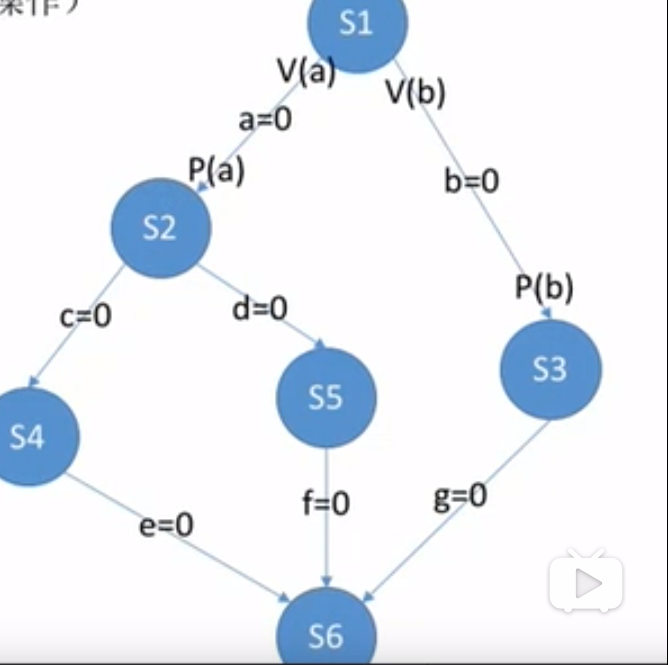

# 进程同步
    1. 进程同步和进程互斥
        * 什么是进程同步
            同步也称直接制约关系，它是指为完成某种任务而建立的两个或多个进程，这些进程因为需要在某些位置上
            协调他们的工作秩序而产生的制约关系。进程间的直接制约关系就是源于它们之间的相互合作
        
        * 什么是进程互斥
            * 临界资源：一个时间段内只允许一个进程使用的资源。对于临界资源必须互斥的访问
            
            * 互斥也叫做间接制约关系：进程互斥是指当一个程序访问某临界资源时，另一个想访问该临界资源的进程
              必须等待当前访问资源的进程访问结束，释放该资源之后，另一个进程才能够访问该资源
            
            * 对临界资源的互斥访问了逻辑上可以分为四个部分：
                1. 进入区：负责检查是否可进入临界区，如果可进入，则应该设置正在访问临界资源的标志（“上锁”）
                          以阻止其他进程同时进入临界区
                2. 临界区：访问临界资源的代码
                3. 退出区：负责解除正在访问临界资源的标志（“解锁”）
                4. 剩余区：做其他处理
                注意：进入区和退出区是负责实现互斥的代码段
            
            * 进程互斥访问临界资源时，需要遵循的原则
                1. 空闲让进：临界区空闲时，可允许一个请求进入临界区的进程立即进入临界区
                2. 忙则等待：当已有进程进入临界区时，其它试图进入临界区的进程必须等待
                3. 有限等待：对请求访问的进程，应保证在有限时间内进入临界区（保证不会饥饿）
                4. 让权等待：当进程不能进入临界区时，应立即释放处理机，防止进程忙等待

    2. 进程互斥的软件实现方法

        1. 单标志法
            * 算法思想：两个进程在访问完临界区后会把临界区的权限转交给另一个进程。也就是说，每个进程进入临界
                        区的权限只能被另一个临界区赋予

            * 分析：
                int turn = 0;//turn 表示当前允许进入临界区的进程号

                P0进程                                  p1进程 
                    while(turn != 0);  1                while(turn != 1);  5
                    critical section;  2                critical section;  6
                    turn = 1;          3                turn = 0;          7
                    remainder section; 4                remainer section;  8

                * turn的初始值为0，只允许0号进程进入临界区。
                
                * 若P1先上处理机运行，则会一直卡在 5 直到P1的时间片用完，发生调度，切换P0上处理机运行，此时代码 1
                  不会卡住P0，P0可以正常访问临界区，在P0访问临界区期间即时切换会P1，P1依然会卡在 5 只有P0在退出区
                  将turn改为1后，P1才能进入临界区
                
                * turn表示当前允许进入临界区的进程号，而只有当前允许进入临界区的进程在访问了临界区之后，才会修改turn
                  的值。也就是说，对于临界区的访问一直是P0->P1->P0->P1...一直轮流访问
                
                * 可能导致的问题：
                    如果P0一直没有访问临界区，那么就算临界区一直空闲，P1也是不能访问的（因为turn的值需要在P0中修改）
                    也就是说，单标志法违背了“空闲让进原则”

        2. 双标志先检验法
            * 算法思想：设置一个布尔型数组flag[],数组中的各个元素用来标记各进程想进入临界区的意愿，比如，flag[0] =
                        true，意味着0号进程P0想要进入临界区。每个进程在进入临界区之前先检查当前有没有别的进程想进入
                        临界区，如果没有，则把自身对应的标志flag[i]设为true，之后开始访问临界区

            * 分析
                bool falg[2];           //表示进入临界区意愿的数组
                flag[0] = false;    
                flag[1] = false;        //刚开始设置为两个进程都不想进入临界区

                P0进程                          p1进程 
                    while(flag[1]);    1            while(flag[0]);    5  //如果此时P0想进入临界区，P1就会一直循环等待
                    flag[0] = true;    2            flag[1] = true;    6  //标记为P1进程想要进入临界区
                    critical section;  3            critical section;  7  //访问临界区
                    flag[0] = false;   4            flag[1] = false;   8  //访问完临界区，修改标记为P1不想使用临界区
                    remainder section;              remainer section;  

                * 若按照1，5,2，6,3，7顺序访问（并发执行）P0和P1将会同时访问临界区
                * 双标志检查法主要问题：违反“忙则等待”原则
                  原因在于，进入区的检查和“上锁”两个处理不是一气呵成，“检查”后“上锁”可能发生进程切换

        3. 双标志后检查法
            * 算法思想：双标志先检查法的改版，前一个算法会导致两个进程同时进入临界区，人们就使用先“上锁”后“检查”的方法，
                        来避免违反“忙则等待”原则

            * 分析
                bool falg[2];           //表示进入临界区意愿的数组
                flag[0] = false;    
                flag[1] = false;        //刚开始设置为两个进程都不想进入临界区

                P0进程                          p1进程 
                    flag[0] = true;    1            flag[1] = true;    5  //标记为P1进程想要进入临界区      
                    while(flag[1]);    2            while(flag[0]);    6  //如果此时P0想进入临界区，P1就会一直循环等待
                    critical section;  3            critical section;  7  //访问临界区
                    flag[0] = false;   4            flag[1] = false;   8  //访问完临界区，修改标记为P1不想使用临界区
                    remainder section;              remainer section;  
    
                * 若按照1,5,2,6...的顺序执行，P0和P1都无法进入临界区
                * 虽然解决“忙则等待”问题，但是又违背了“空闲让进”和“有限等待”原则，会因为各进程长期无法访问临界资源而产生
                  饥饿现象。两个进程都争着想进入临界区，但是谁也不让着谁，最后两个都无法进入临界区

        4. Peterson算法
            * 算法思想：由于双标志后检查法两者相争没有进程能够进入临界区，Peterson就想到了在双标志后检查法的基础上主动让
                       对方使用临界区
            
            * 分析：
                bool falg[2];           //表示进入临界区意愿的数组，初始值为false
                int turn = 0;           //turn表示优先让哪个进程进入临界区

                P0进程                           
                    flag[0] = true;                 1                 
                    turn = 1;                       2
                    while(flag[1] && turn == 1);    3              
                    critical section;               4  
                    flag[0] = false;                5   
                    remainder section;                
    
                p1进程
                    flag[1] = true;                 6           //表示自己想进入临界区
                    turn = 0;                       7           //可以优先让对方进入临界区
                    while(flag[0] && turn == 0);    8           //对方想进就让对方进，自己循环等待
                    critical section;               9
                    flag[1] = false;                10          //访问完临界区，修改标记为P1不想使用临界区
                    remainer section;

                * Peteson算法用软件方法解决了进程互斥问题，遵循了空闲让进，忙则等待，有限等待三个原则，但是依然未
                  遵循让权等待
                * 此算法进行了1,2,3步

    3. 进程互斥的硬件实现方法
        1. 中断屏蔽方法
            * 利用“开/关中断指令”实现（与原语的实现思想相同，即在某进程开始访问临界区到结束访问为止都不允许中断
              也就不能发生进程切换，因此也就不可能发生两个同时访问临界区的情况）

            * 优点：简单,搞笑
            * 缺点：不适于多处理机，只适用于操作系统内核进程，不适用于用户进程（因为开/关中断指令只能在内核态运行
                    这组指令如果能让用户随意使用会很危险） 

        2. TestAndSet指令
            * 简称：TS指令，也称TestAndSetLock指令或TSL指令
            
            * TSL指令是用硬件实现的，执行过程中不允许中断，只能一气呵成
            
            * 相比软件实现方法，TSL指令把“上锁”和“检查”操作用硬件的方式变成了一气呵成的原子操作

            * 优点：实现简单，无需像软件实现方法那样严格检查是否会有逻辑漏洞，适用于多处理机环境

            * 缺点：不满足让权等待原则，暂时无法进入临界区的进程会占用CPU并循环执行TSL指令，从而导致“忙等”

        3. Swap指令
            * 有地方也叫Exchange指令，或者XCHG指令

            * Swap指令是用硬件实现的，执行过程不允许中断，只能一气呵成。

            * 分析：c语言逻辑
                //Swap指令的作用是交换两个变量的值
                Swap(bool *a, *b) {
                    bool temp;
                    temp = *a;
                    *a = *b;
                    *b = temp;
                }

                //lock表示当前临界区是否加锁
                bool old = true;
                while(old == true )
                    Swap(& block，&old);
                临界代码区。。。
                lock = false;
                剩余代码区

                * 逻辑上Swap与TSL无太大区别，都是先记录下此时临界区是否已经被上锁（old变量）在将上锁标记设置为true
                  最后检查old，如果old为false这说明之前没有别的进程对临界区上锁，则可跳出循环，进入临界区

                * 优点：实现简单，无需像软件实现方法那样严格检查是否会有逻辑漏洞，适用于多处理机环境

                * 缺点：不满足让权等待原则，暂时无法进入临界区的进程会占用CPU并循环执行TSL指令，从而导致“忙等”

    4. 信号量机制
        * 概述
            * 用户进程可以通过使用操作系统提供的一对原语来对信号量进行操作，从而方便的实现了进程同步和进程互斥
            * 信号量其实就是一个变量，可以用一个信号量来表示系统中某种资源的数量，比如：系统中只有一台打印机，
              就可以设置一个初值为1的信号量
            * 原语的执行一气呵成，不可中断，软件提供的解决方案的主要问题就是“进入区的各种操作无法一气呵成”，那么
              如果能把进入区，退出区的操作都用原语实现，这些操作就能一气呵成实现了
            * 一对原语：wait(S)原语和signal(S)原语，括号里的函数S就是函数调用时传入的一个参数
            * wait，signal原语常简称为P、V操作

        * 整型信号量
            * 用一个整数型的变量作为信号量，用来表示系统中某种资源的数量（与普通整数变量的区别：对信号量的操作只有
              三种，即初始化，P操作，V操作）
            * 分析
                假设某计算机中有一台打印机
                int S = 1; //初始化整型信号量S，表示当前系统中可用打印机资源数

                void wait (int S) {         //wait原语相当于"进入区"（检查和上锁一气呵成，避免了并发和异步导致的问题）
                    while (S <= 0);         //如果资源数不够就一直循环等待
                    S = S -1;               //如果资源数够，则占用一个资源
                }

                void signal(int S) {        //signal原语相当于“退出区”
                    S = S + 1;              //使用完资源后，在退出区释放资源
                }

                进程P0
                ...
                wait(S);                    //进入区，申请资源
                使用打印机资源               //临界区，访问资源
                signal(S);                  //退出区，释放资源

            * 存在问题：不满足让权等待原则，会发生忙等

        * 记录型信号量
            * 由于整型信号量是存在“忙等”问题，因此人们提出“记录型信号量”即用记录型数据结构表示的信号量

            * 分析
                //记录型信号量的定义
                typedef struct {
                    int value;              //剩余资源数
                    struct process *L       //等待队列
                }

                某进程需要使用资源时，通过wait原语申请
                void wait (semaphore S) {
                    S.value--;
                    if (S.value < 0) {
                        block(S.L);//如果剩余资源数不够，使用block原语使进程从运行态进入到阻塞态
                    }
                }

                进程使用完资源后，通过signal原语释放
                void signal (semaphore S) {
                    s.value++;
                    if(S.value <= 0) {
                        wakeup(S.L);//释放资源后，若还有别的进程在等待这种资源，则使用wakeup原语唤醒等待队列中
                                    //的一个进程，该进程从阻塞态变为就绪态
                    }
                }
            
            * 注意 
                * wait和signal着队员与可用于实现系统资源的“申请”和“释放”
                * 对信号量S的一次PV操作意味着进程请求一个单位的该类资源，因此需要执行S.value--，表示资源数减1，
                  当value < 0时，表示该类资源已经分配完毕，因此进程应该调用block原语进行自我阻塞（当前运行的
                  进程从运行态到阻塞态），主动放弃处理机，并插入该类资源的等待队列S.L中，可见该机制遵循了“让权
                  等待”原则，不会出现忙等的现象
                * 对信号量S的一次V操作意味着进程释放一个单位的该类资源。因此需要执行S.value++，表示资源数+1，
                  若加1后仍然是S.value <= 0,表示依然有进程在等待该类资源，因此调用wakeup原语唤醒等待队列中的
                  第一个进程（被唤醒进程从阻塞态到就绪态）    

    5. 如何用信号量机制实现进程互斥，进程同步和进程的前驱关系        
        * 信号量机制实现进程互斥
            1. 分析并发进程的关键活动，划定临界区（如：对临界资源打印机的访问就应该放在临界区）
            2. 设置互斥信号量mutex，初值为1
            3. 在临界区之前执行P(mutex)
            4. 在临界区之后执行P(mutex)

            * 注意：对于不同的临界资源需要设置不同的互斥信号量。
                    P/V操作必须成对出现，缺少P(mutex)就不能保证临界资源的互斥访问。缺少V(mutex)会导致资源永不释放
                    等待进程永远不会被唤醒

        * 信号量机制实现进程同步
            * 回顾
                * 进程同步：要让个进程按要求有序的执行
                * 分析
                    比如：P1,P2并发执行，由于存在异步性，因此二者交替推进的秩序是不确定的
                    
                    P1() {
                        代码1;
                        代码2;
                        代码3;
                    }

                    P2() {
                        代码4;
                        代码5;
                        代码6;
                    }

                    若P2的“代码4”要基于P1的“代码1”和“代码2”的运行结果才能执行，那么我们就必须保证“代码4”
                    一定是在“代码2”之后会执行
                    这就是进程同步问题，让本来异步并发的进程互相配合，有序推进
            
            * 实现
                1. 分析什么地方需要实现“同步关系”，即必须保证“一前一后”执行的两个操作
                2. 设置同步信号量S,初始值为0
                3. 在“前操作”之后执行V(S)。也就是指在执行完上述“一前一后”中前面那个操作之后执行V(S)
                4. 在“后操作”之前执行P(S).也就是指在执行完上述“一前一后”中后面那个操作之后执行P(S)

                * 分析
                    semaphore S = 0; //初始化同步信号量，初始值为0
                    
                    P1() {                                      P2() {
                                                                      P(S);
                        代码1;                                        代码4;
                        代码2;                                        代码5;
                        V(S);
                        代码3;                                        代码6;
                    }                                           }
                        
                   分了两种情况（这就保证代码4一定是在代码2之后执行）
                    * 若先执行到V(S),则S++后 S = 1。之后当执行到P(S)操作时，由于S = 1，表示有可用资源
                      执行性S--，S的值变回0，P2进程不会执行block原语，而是继续执行代码4

                    * 若先执行到P(S)操作，由于S = 0，S--后S = -1，表示此时没有可用资源，因此P操作中会执行
                      block原语，主动要求阻塞，之后当P1进程执行完代码2,继而执行V(S)操作，S++，使S变回0，由
                      于此时有进程在该信号量对应的阻塞队列中，因此会在V(S)操作中执行wakeup原语，唤醒P2进程，
                      然后P2就能继续执行代码4    
                       
        * 信号量机制实现前驱关系
             * 值的注意的是每一对前驱动操作都是一个进程同步问题（需要保证一前一后的操作）
                因此实现前驱动关系需要：
                    1. 为每一对前驱动关系设置一个同步变量
                    2. 在“前操作”之后对相应的同步变量执行V操作
                    2. 在“后操作”之前对相应的同步变量执行P操作

  

    