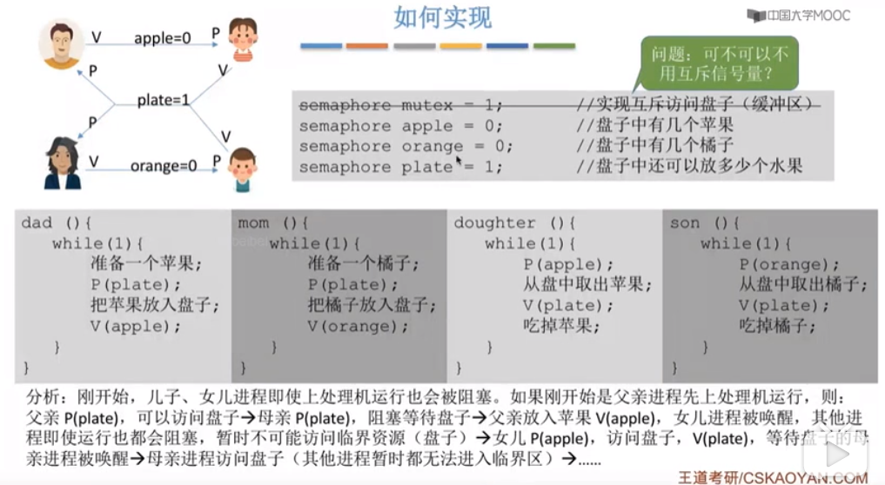
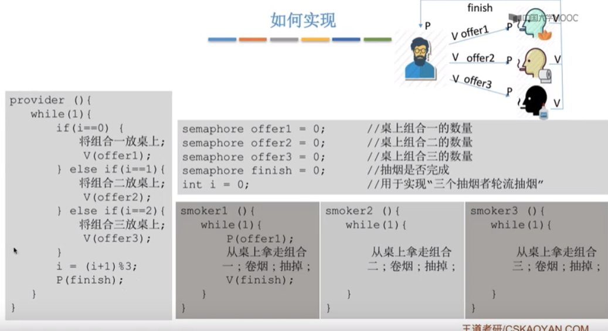
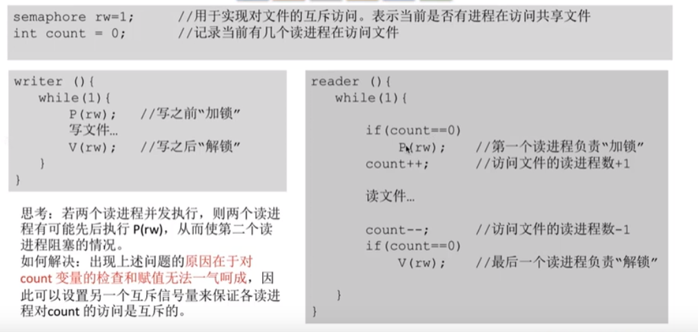

# 进程同步
    1. 生产者消费者的问题
        * 系统中有一组生产者进程和一组消费者进程，生产者进程每次生产一组产品放入缓冲区，消费者进程
          每次从缓存区中取出一个产品使用（这里的产品其实就是指一组数据）

        * 生产者，共享一个初始值为空、大小为n的缓存区
        * 只有缓存区没满时，生产者才能把产品放入缓存区，否则必须等待（同步）
        * 只有缓存区不空时，消费者才能从中取出产品，否则必须等待（同步）
        * 缓存区是临界资源，各个进程必须互斥的访问（互斥）

        * 实现细节
            生产者每次要消耗一个空闲的缓存区时，都需要进行一次P操作，而生产一个产品则需要执行V操作，
            消费者每次消耗一个产品需要执行一次P操作，释放一个空闲的缓存区时，需要执行一次V操作
        
        * 代码分析
            semaphore mutex = 1;               //互斥信号量，实现对缓冲区的互斥访问
            semaphore empty = 0;               //同步信号量，表示空闲缓冲区的数量
            semaphore full = 0;                //同步信号量，表示产品的信号量也表示非空缓存区的数量

            producer() {
                while(1) {                                                      //正确顺序      错误顺序
                    生产一个产品;
                    P(empty);           //消耗一个空闲缓存区                        1               2
                    P(mutex);           //实现互斥是在同一进程中进行一对PV操作       2                1
                    把产品放入缓存区;
                    V(mutex);           //实现互斥是在同一进程中进行一对PV操作
                    V(full);            //增加一个产品
                }
            }

            comsumer() {
                while(1) {
                    P(full);             //消耗一个产品                            3                4
                    P(mutex);                                                     4                3
                    从缓存区取出一个产品;
                    V(mutex);           
                    V(empty);            //增加一个空闲缓存区
                    使用产品;
                }
            }

            不能改变相邻的PV操作的顺序，如果按照错误顺序执行：
                * 假如此时缓冲区已经存满产品，则full = n， empty = 0
                  则生产者进程先执行1使得mutex边为0,然后执行2，由于没有空闲缓存区，因此生产者会被阻塞
                  由于生产这被阻塞，因此就会切换为消费者进程，那么消费者执行3，由于mutex为所以生产者还没有释放
                  对临界资源的锁，因此消费者进程也就进入了阻塞状态
                
                * 这就会造成生产者在等待消费者释放空闲缓存区，而消费者又在等待生产者释放缓存区。就是说两者都在等待
                  对方唤醒，从而进入了一个死循环，也叫做“死锁”

            结论：实现互斥的P操作一定要在实现同步的P操作之后

    2. 多生产者多消费者     
        * 案例：如果不设置互斥访问的变量，那么可能会导致儿子，女儿在执行P操作时，就可进入阻塞状态
            注意：如果缓存区大于1的话，那么，父亲和母亲（两个进程）可以同时访问缓存区，就有可能导致
                 两个进程写入缓存区的数据相互覆盖的情况，所以，如果缓存区大于1得换，就必须设置一个
                 互斥信号量mutex来保证互斥访问缓存区

    3. 吸烟者问题
        * 问题：假如有一个供应原料者，依次供应胶水和烟叶（组合一），烟叶和卷纸（组合二），卷纸和胶水（组合三），
                有三个吸烟者，它们只有三个原料中的一个，那么，我们需要实现三个吸烟者轮流吸烟。就需要通过PV操作来实现

        * 经过分析：发现同步关系有4组（从事件的角度分析）
            1. 桌子上有组合一 ---> 第一个抽烟者取走东西
            2. 桌子上有组合二 ---> 第二个抽烟者取走东西
            3. 桌子上有组合三 ---> 第三个抽烟者取走东西
            4. 发出完成喜好 ---> 供应则将下一个组合放到桌上

        * 代码实现分析

        

        * 注意：若一个生产者需要生产多个产品（或者说会引发多种前驱事件），那么各个V操作应该放在各自对应的“事件”发生
              之后的位置

    4. 读者和写者问题
        * 有读者和写者两组并发进程，共享一个文件，当两个或两个以上的读写进程同时访问共享数据时，不会产生副作用，但若
          某个写进程和其他进程（读进程或写进程）同时访问共享数据时则可能导致数据不一致。
        * 实现要求：
            1. 允许多个读者可以同时对文件执行读文件操作
            2. 只允许一个写者往文件中写信息
            3. 任一写着在完成写操作之前不允许其他写者或读者工作
            4. 写者在执行写操作之前，应该让已有的读者或写者全部退出
        
        * 代码实现
    
  
               
        

