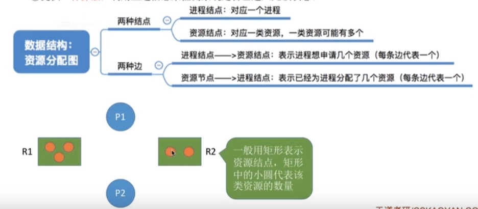

# 死锁
    1. 什么是死锁
        * 相关概念：
            1. 死锁：在并发环境下，各进程因竞争资源而造成的一种互相等待对方手里资源，导致各进程都阻塞，都无法向前
                 推进的现象，就是死锁。发生死锁后若无外力的干涉，这些进程都无法向前推进

            2. 饥饿:由于长期等待不到想要的资源，某进程无法向前推进的现象。例如：在短进程优先的算法中，若有源源不断
                    的短进程到来，则长进程一直得不到处理机，从而发生饥饿现象

            3. 死循环：某进程执行过程中一直跳不出某个循环的现象。有可能是由于程序造成的bug，也有可能是自己设计的

            * 注意：死锁和饥饿问题是由于操作系统分配资源的策略不合理导致的，而死循环是由于代码的逻辑错误而导致的。
                    死锁和饥饿是管理者（操作系统）的问题，死循环是被管理者的问题
    
    2. 产生死锁的必要条件
        1. 互斥条件：只有对必须互斥使用的资源的争抢才会导致死锁。像内存，扬声器这样可以同时让多个进程使用的资源是
           不会导致死锁的

        2. 不剥夺条件：进程所获得的资源在资源未使用完之前，不能由其他进程强行剥夺，只能是强行释放

        3. 请求和保持条件：进程已经保持有了至少一个资源，但又提出了新的资源请求，而该资源又被其他进程占有，此时请
           求资源被阻塞，但又对自己已有的资源保持不放

        4. 循环等待条件：存在一种进程资源的循环等待链，链中的每一个进程以获得的资源同时被下一个进程所请求

        * 注意：发生循环等待一定有未必就是死锁，但是发生死锁就一定会有循环等待

    3. 什么时候会发生死锁
        1. 对系统资源的竞争。各进程对不可剥夺资源的竞争可能引起死锁，对可剥夺的资源（CPU）的竞争是不会引起死锁的

        2. 进程推进的顺序非法。请求和释放资源的顺序不当，也同样会导致死锁。例如，并发执行的进程P1,P2分别占用了资源
           R1,R2，而之后进程P1又申请R2，P2进程又申请R1，那么两者会因为申请的资源被对方占用而阻塞，从而发生死锁

        3. 信号量的使用不当也可能会造成死锁。例如：在生产者消费者问题中，如果实现互斥的P操作在实现同步的P操作之前
            就可能会导致死锁
        
    4. 死锁的处理策略
        * 策略概述
            1. 预防死锁。破坏死锁产生的必要条件中的一个或几个

            2. 避免死锁。用某种方法防止系统进入不安全状态，从而避免死锁（银行家算法）

            3. 死锁的检测和解除。允许死锁的发生，不过操作系统会负责检测操作系统的发生，然后采取措施解除死锁

    5. 预防死锁
        1. 破坏互斥条件
            * 实现：将互斥使用的资源改造为共享使用的资源，那么系统就不会进入死锁状态。比如：使用SPOOLing技术
                    可以将独占的设备逻辑上变为共享的设备。
                    
            * 举例：假如有两个进程A,B想使用打印机，在正常情况下，使用打印机，只能是A先使用然后B使用（或者B先
                    使用，然后A使用），但是在使用了SPOOLing技术后，在个进程看来自己使用打印机的请求会立即被
                    处理了，就不需要再进行阻塞等待
                
            * 缺点：并非所有的资源都能够改造成可共享使用的资源，为了保护系统安全，很多时候依然需要保护这种互斥
                    性。因此很多时候都无法破坏互斥条件
            
        2. 破坏不剥夺条件
            * 实现：
                1. 当某个进程请求的资源得不到满足时，他必须立即释放保持的所有资源，待以后需要时在再申请。
                2. 当某个进程需要的资源被其他进程所占有时，可以由操作系统协助，将想要的资源强行剥夺过来。这种方式
                    需要考虑优先级（比如：剥夺调度方式）
            
            * 缺点：
                1. 实现起来比较复杂
                2. 释放已经获得的资源可能导致前一阶段的工作失效
                3. 反复申请和释放资源会增加系统得开销
                4. 方案一，需要释放所有资源，需要时重新申请，如果一直发生这样的情况可能会导致进程饥饿

        3.破坏请求和保持条件
            * 实现：采用静态分配方法，即进程在运行前一次性申请完它所需的全部资源，在它资源未满足前，不让它投入运行
                    一旦投入运行后，这些资源就一直归它所有，该进程就不会申请其他任何资源了
            
            * 缺点：有些资源可能只需要用很短的时间，因此如果进程的整个运行期间一直保持着所有的资源，就会造成严重的
                    资源浪费，资源利用率极低。另外有可能会造成某些进程饥饿

                    举例：假设进程A,B分别需要使用资源R1,R2,而进程C需要同时拥有R1,R2，才能运行，那么此时可能由于A
                            多次请求资源R1,那么这就可能导致C一直不能获取到R1从而进入饥饿状态
                    
        4. 破坏循环等待条件
            * 实现：采用顺序资源分配法，首先给系统资源编号，规定每个进程必须按照编号递增的顺序请求资源，同类资源一次
                    申请完
            
            * 实现原理：一个进程只有占有小编号的资源时，才有资格申请更大编号的资源。按照此规则，已经持有大编号的资源
                        的进程不可能逆向的回来申请小编号的资源，从而不会产生循环等待现象

            * 缺点：
                1. 不方便添加新的设备，因为可能需要重新编号所有设备
                2. 进程实际使用的资源顺序可能和编号递增顺序不一致，会导致资源的浪费
                3. 必须按照规定次序申请资源，用户编程麻烦
                             
    6. 死锁的处理
        1. 什么是安全序列
            * 安全序列：就是指如果系统按照这种序列分配资源，则每个进程都能够顺利完成。只要能找出一个安全序列，系统就是
                        安全状态。安全序列可能有多个。
            
            * 如果分配了资源之后。系统中找不出任何一个安全序列，系统就进入了不安全状态。这就意味着之后可能所有进程都无
              法顺利的进行下去。当然如果有进程提前归还了一些资源，那系统也可能重新回到安全状态，不过在分配资源之前总是
              要考虑到最坏情况。
            
            * 如果系统处于安全状态，就一定不会发生死锁。如果系统不处于安全状态，就可能发生死锁（处于不安全状态未必就发生
              了死锁，但发生死锁时一定是在不安全状态）

            * 安全性算法的实现步骤
                1. 检查当前的剩余可用资源是否还能满足某个进程的最大请求，如果可以就把该进程加入安全序列，并把该进程持有
                   的资源全部收回

                2. 循环上面操作，查看是否所有进程都能够进入安全序列

        2. 银行家算法
            * 银行家算法的核心思想：在分配资源之前预先判断这次分配是否会导致系统进入不安全状态。如果会进入不安全状态，就
              暂时不答应这次请求，让该进程先阻塞等待
            
            * 实现步骤
                1. 检查此次申请是否超过了之前声明的最大需求数
                2. 检查系统剩余的可用资源是否还能满足这次请求
                3. 试探着分配，更改个数据结构
                4. 用安全性算法检查此次分配是否会导致系统进入不安全状态

  

    7. 死锁的检测和解除
        * 死锁的检测
            1. 用某种数据结构来保存资源的请求和分配信息
            2. 提供一种算法，利用上述信息来检测系统是否已进入死锁状态

 

    
        * 死锁的解除
            * 主要方法
                1. 资源剥夺法：挂起（暂时放到外存上）某些死锁进程，并抢占它的资源，将这些资源分配给其他死锁进程。但是应该
                              防止被挂起的进程长时间得不到资源而饥饿
                2. 撤销进程法（终止进程法）：强制撤销部分，甚至全部死锁进程，并剥夺这些进程的资源。这种方式优点是实现简单
                            但是付出的代价可能会很大。因为有些进程可能运行很长时间，一旦撤销，需要从头再来
                3. 进程回退法：让一个或多个死锁进程回退到足以避免死锁的地步，这就要求系统要记录这些历史信息，设置还原点

            * 判断对那个进程进行上述操作的依据：
                1. 进程优先级
                2. 已执行多长时间
                3. 还要多久能完成
                4. 进程已经使用了多少资源
                5. 考虑进程是交互式的还是批处理式的进程（抛弃批处理进程）
