# 内存管理概念
    1. 内存的基础知识
        * 相关概念
            * 内存：是用于存放数据的硬件。程序执行前需要先放到内存中才能被CPU处理

            * 存储单元：存储数据的具体单位

            * 内存地址：是一种用于软件及硬件等不同层级中的数据概念，用来访问电脑主存中的数据。

            * 编译：由源代码文件爱你生成目标模块（高级语言翻译为机器语言）

            * 链接：由目标模块生成装入模块，链接后生成完整的逻辑地址

            * 装入：将转入模块装入内存，装入后形成物理地址
        
        * 相对地址又称逻辑地址，绝对地址又称物理地址

        * 进程运行的基本原理

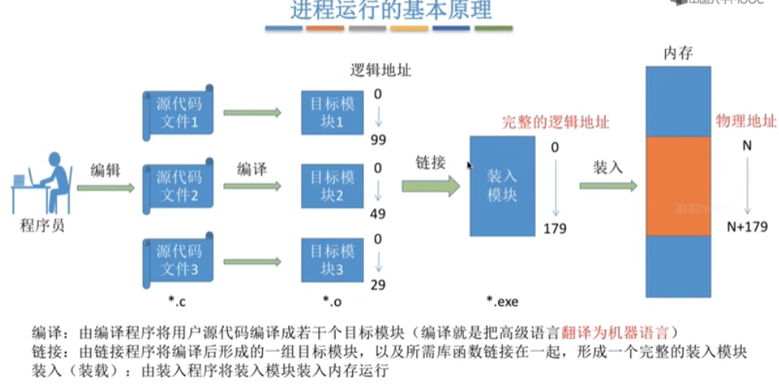

        * 从写程序到程序运行

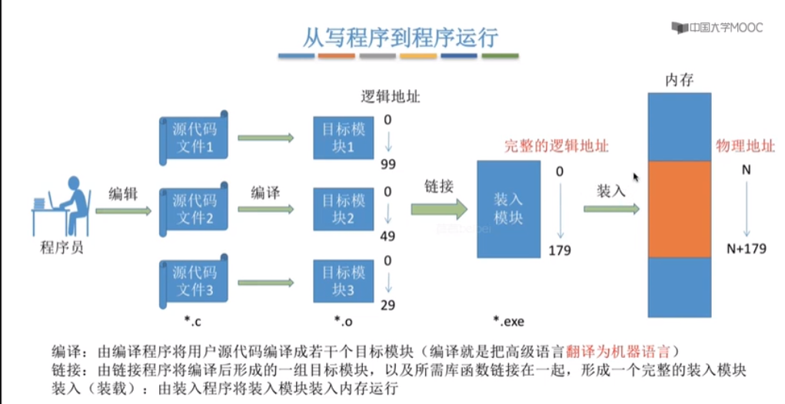

        * 装入模块装入内存

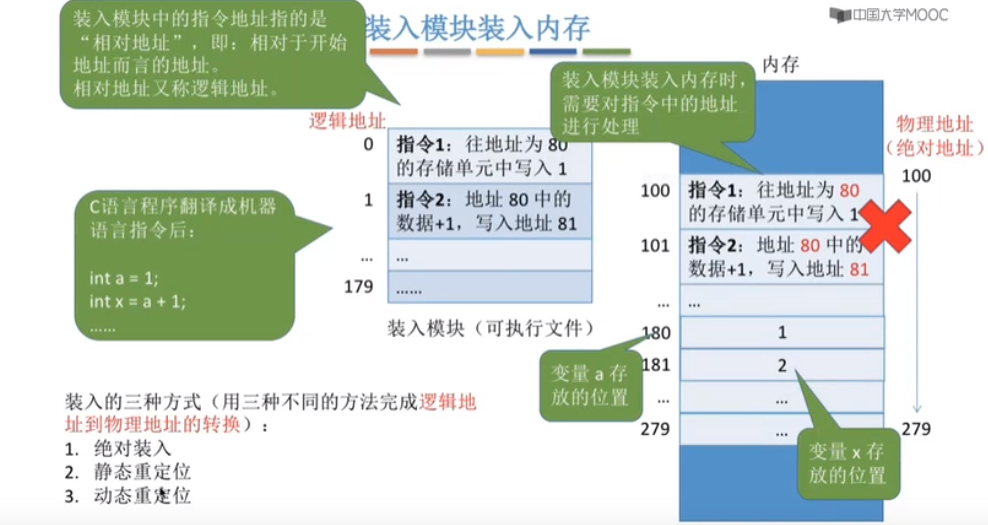

        * 装入的三种方式
            1. 绝对装入
                1. 概念：在编译时，如果知道程序放到内存中的哪个位置，编译程序将产生绝对地址的目标代码。装入程序按照装
                        入模块中的地址，将程序和数据装入内存。
                2. 绝对装入只适用于单道程序环境
            
            2. 静态重定位
                1. 概念：又称为可重定位装入。编译，链接后的装入模块的地址都是从0开始的，指令中使用的地址，数据存放的
                        地址都是相对于起始地址而言的逻辑地址。可根据当前的情况，将装入模块装入到内存适当的位置。装入
                        时，对地址进行重定位，将逻辑地址变换为物理地址（地址变换是在装入时一次完成的）
                        
                2. 特点：在一个作业装入内存时，必须分配其要求的全部内存空间，如果没有足够的内存就不能装入该作业。作业
                        一旦进入内存后，在运行期间就不能在移动，也不能再申请内存空间
                    
            3. 动态重定位
                1. 概念：又称为动态运行时装入。编译，链接后的装入模块的地址都是从0开始的。装入程序将装入模块装入内存
                        后，并不会把逻辑地址转换为物理地址，而是把地址转换推迟到程序真正要执行时才进行。因此转入内存后
                        所有的地址依然是逻辑地址。这种方式需要一个重定位寄存器来支持。
                
                2.特点：采用动态重定位时允许程序在内存中发生移动

                3. 重定位寄存器：用于存放转入模块的起始位置

        * 链接的三种方式
            1. 静态链接：在程序运行之前，先将个目标模块以及它们所需的库函数连接成一个完整的可执行文件（装入模块），之后
                        不再拆开

            2. 装入时动态链接：将各目标模快装入内存时，边装入边链接的链接方式

            3. 运行时动态链接：在程序执行中，需要该目标模块时，才对它们进行链接。其优点是便于修改和更新，便于实现对目标
                              模块的共享

    2. 内存管理的概念：
        * 内存管理需要实现的功能：
            1. 内存空间的分配与回收
            2. 内存空间的扩展
            3. 地址转换（逻辑地址与物理地址的转换）：可以通过三种装入方式解决
            4. 内存保护 
                * 方法一：在CPU中设置一对上，下限寄存器，存放进程的上、下限地址。进程的指令要访问某个地址时，CPU检查是否
                         越界
                * 方法二：采用重定位寄存器（又称为基址寄存器）和节地址寄存器（又称为限长寄存器）进行越界检查。前者存储的是
                         起始物理地址，后者存放的是最大逻辑地址

    3. 覆盖与交换（用于内存空间的扩展）
        1. 覆盖技术
            * 引入覆盖技术的目的：解决程序大小超过物理内存总和的问题

            * 覆盖技术的思想：将程序分为多个段（多个模块）常用的段常驻内存，不常用的段在需要时调入内存

            * 内存中分为一个“固定区”和多个“覆盖区”。常驻内存的段放在“固定区”，调入后不再调出（直到程序结束），不常用的段
              放在“覆盖区”，需要时调入内存，不需要时，调出内存

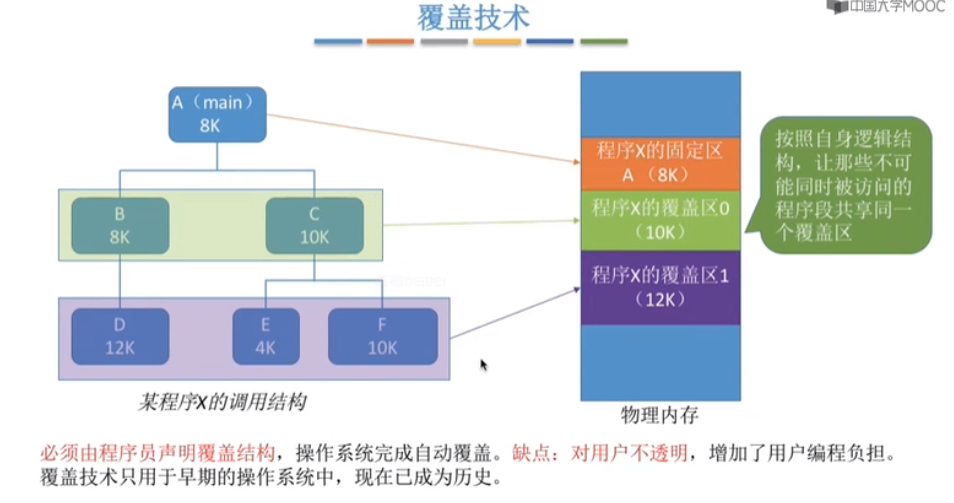

        2. 交换技术
            * 交换技术的设计思想：内存紧张时，系统将内存中的某些进程暂时换出外存，把外存中某些已具备运行条件的进程换入内存
                                （进程在内存与磁盘间动态调度）
            
            * 应该在外存（磁盘）的什么位置保存被换出的进程？
                具有对换功能的操作系统中，通常把磁盘空间分为文件区和兑换区两部分。文件区主要存放文件，主要追求存储空间的利
                用率，因此对文件区的空间管理采用离散分配方式，对换区空间只占磁盘空间的小部分，被换出的进程数据就存放在对换
                区。兑换区的速度直接影响系统整体速度，所以一般只追求换入换出速度，兑换区采用连续分配方式。总之，对换区的I/O
                速度比文件区快

            * 什么时候交换
                通常在许多进程运行，且内存吃紧时进行，而系统负荷降低就暂停。

            * 换出哪些进程
                优先换出阻塞进程，优先级低的进程

            * 注意：PCB会常驻内存，不会被换出外存

        3. 交换与覆盖的区别
            覆盖是在同一个程序或进程中，交换是在不同进程（或作业）之间的

    4. 连续的分配管理方式（用于内存的分配和回收）
        * 概念：
            连续分配：指用用进程分配必须是一个连续的内存空间

        * 分类：
            1. 单一的连续分配方式

            2. 固定分区分配

                * 在固定分区分配中操作系统需要建立一个数据结构--分区说明表，来实现各个分区的分配与回收。每个表项
                  对应一个分区，每个表项包括对应分区的大小、起始地址、状态（是否已分配）

                * 当某程序需要装入内存时，由操作系统内核程序根据用户程序大小检索该表，从中找到一个能满足其大小的、
                  未分配的的分区，将之分配给该程序，然后修改状态为“已分配”

                * 优点：实现简单，无外部碎片

                * 缺点：
                    1. 当用户进程过大时，可能所有的分区都不能满足需求，此时不得不采用覆盖技术来解决，这会降低性能
                    2. 会产生内部碎片，内存利用率极低

            3. 动态分区分配
                * 概念：动态分区分配又称为可变分区分配。这种过分配方式，不会预先划分内存分区，而是在进程装入内存时，
                        根据进程的大小动态的建立分区，并使分区的大小正好适合进程的需要。因此系统分区的大小和数目是
                        可变的。
                
                * 问题一：系统用什么样的数据结构记录内存的使用情况？

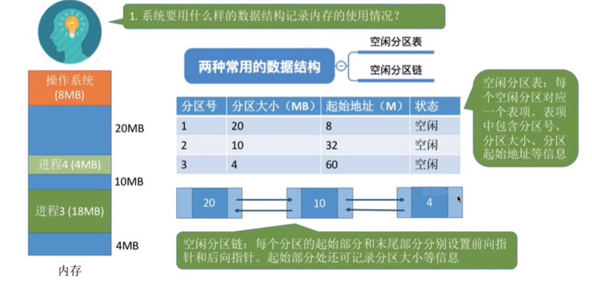
            
                * 问题二：当有多个空闲分区满足需求时，应该选择哪个分区进行分配
                    * 可以按照一定动态分区分配算法来进行分配。从空闲分区表或分区链中选择一个分区分配给该作业。
                
                * 问题三：如何进行分区的分配与回收
                    * 基于空闲分区表的分配
                        * 情况一：如果分区大小大于进程的大小，就直接将分区大小减去使用部分的大小（进程的大小），此时
                                 状态依然为空闲，只是修改了分区的大小以及起始地址。

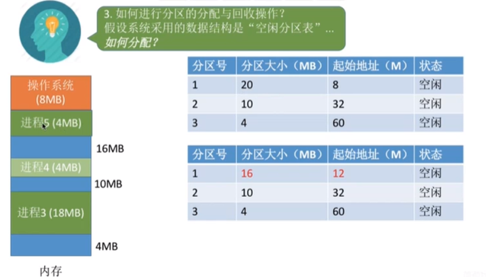

                        * 情况二：如果分区大小等于进程的大小，那么分区就会被占用，分区减少1

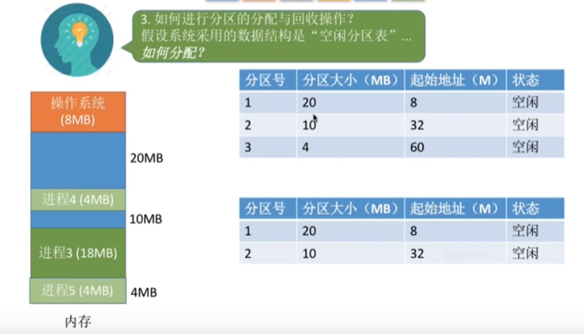

                    * 基于空闲分区表的回收
                        * 情况一：回收区后面有一个相邻的空闲分区，那么就会将回收后的大小添加到后面的空闲分区中

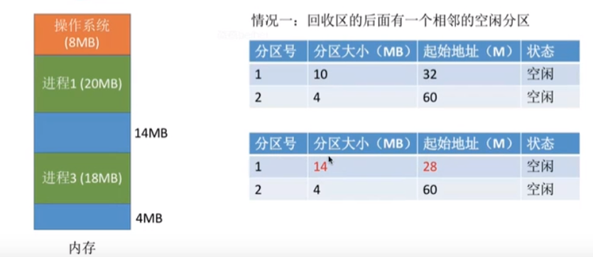

                        * 情况二：回收区的前面有一个相邻的空闲分区，那么就会将回收后的大小添加到前面的空闲分区中
            
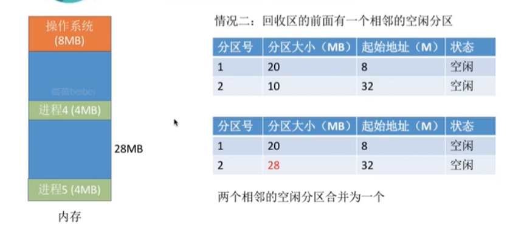

                        * 情况三：回收区的前面和后面都会有一个相邻的空闲区，那么将将三者都合并

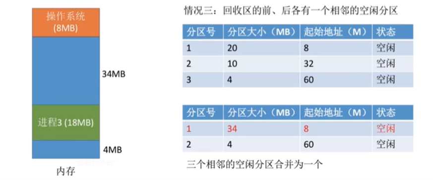

                        * 情况四：回收区的前后都没有相邻的空闲区，那么就需要新增加一个空闲分区（表项）

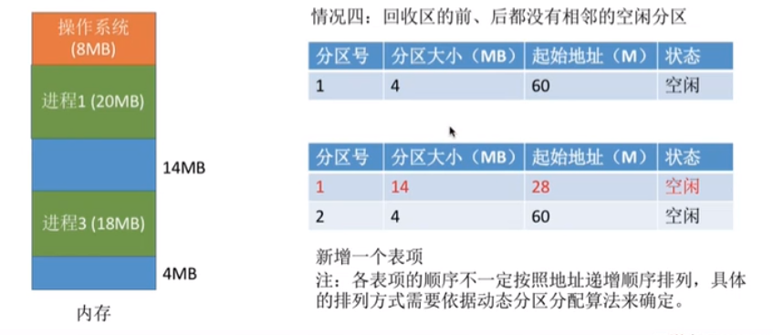

            4. 动态分区分配没有内部碎片，但是有外部碎片
                * 内部碎片：分配给某进程的内存区域中，有些部分没有用上
                * 外部碎片：是指内存中某些空闲分区由于太小而难以利用
                * 注意：如果内存中空闲空间的总和本来可以满足某进程的总和，但是由于进程需要一块连续的内存空间，因此，
                        这些碎片不能满足进程的需求。这是我们可以通过紧凑技术来解决外部碎片

            5. 动态分区分配算法
                * 解决问题：
                    动态分区分配算法：在动态分区分配方式中，当很多个空闲分区都能满足需求时，应该选择哪一个分区进行分配？

                * 首次适应算法：
                    算法思想：从低地址开始查找，找到第一个能够满足进程大小的分区进行分配
                    
                    实现：空闲分区以地址递增的次序排列。每次分配内存时顺序查找空闲分区链（空闲分区表），找到第一个能满足
                         的即可

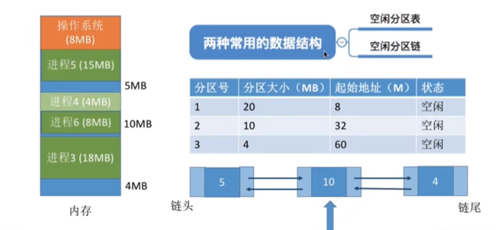  

                * 最佳适应算法
                    算法思想：由于动态分区分配是一种连续的分配方式，为各进程分配的空间必须是连续的一整片区域，因此为了保
                             证当大进程到来时能有连续的大片空间可以尽可能多的留下大片的空闲区，优先使用更小的空闲区

                    实现：空闲分区按照容量递增次序链接。每次分配内存时顺序查找空闲分区链（空闲分区表），找到第一个能满足
                          的即可

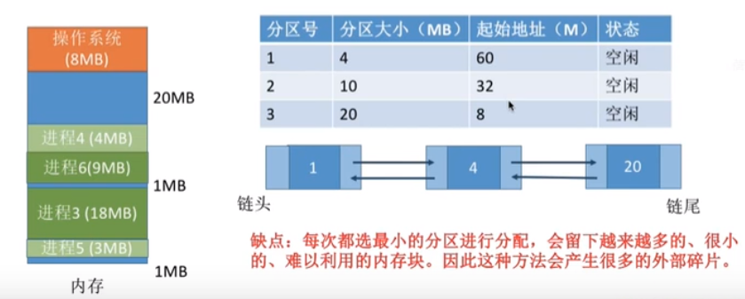 

                * 最坏适应算法（最大适应算法）
                    算法思想：为了解决最佳适应算法的问题，留下太多难以利用的小碎片，可以在每次分配时优先使用最大的连续空
                             闲区，这样分配后的剩余的空间就不会太小，更方便使用

                    实现：空闲分区按照容量递减次序链接。每次分配内存时顺序查找空闲分区链（空闲分区表），找到第一个能满足
                         的即可

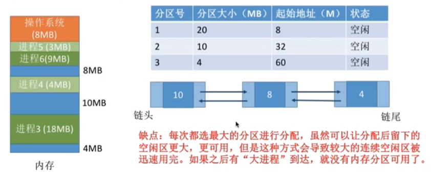 

                * 临近适应算法
                    算法思想：首次适应算法每次都从链头开始查找，这可能会导致低地址部分产生很多小的空闲分区，而每次分配查
                    找时，都要经过这些分区，因此也增加了查找的开销。如果每次从上次查找结束的位置开始检索，就能解决上诉问题
                    
                    实现：空闲分区以地址递增的顺序排列（可排成一个循环链表）。每次分配内存时，从上次查找=的位置开始查找空
                         闲分区链（空闲分区表），找到第一个能满足的即可

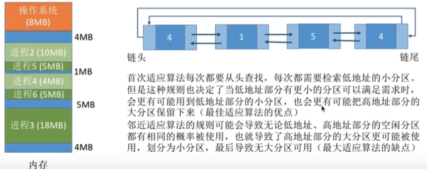 
        
                * 算法对比总结表

 

    5. 非连续分配的管理方式
        * 离散分配方式（非连续分配方式）的产生

        * 非连续分配方式：为用户进程分配的可以是一些分散的内存空间

        * 分类
            1. 基本分页存储管理
                * 思想：把内存分为一个个相等的小分区，再按照分区大小把进程拆分成一个个小部分

                * 把“固定分区分配”改造为“非连续分配版本”

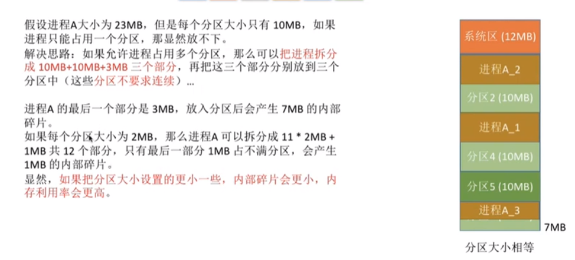

                * 基本概念
                    * 将内存空间分为一个个大小相等的分区，每个分区就是一个“页框”（页帧，内存块，物理块），每个页框有
                      一个编号即“页框号”（内存块号，页帧号，物理块号），页框号从0开始

                    * 将用户进程的地址空间也分为与页框大小相同的一个个区域，称为“页”（页面）。每个页面也有一个编号，
                      即“页号”页号也是从0开始的

                    * 进程的最后一个页面肯可能没有一个页框那么大（因为进程的大小不一定刚好整分）。因此页框不能太大，
                      否则会产生过多的内部碎片
                    
                    * 操作系统以页框为单位为各个进程分配内存空间。进程的每个页面分别放入一个页框中，也就是说页面与页
                      框是一一对应的关系

                * 如何实现地址的转换

                * 分页存储中实现地址转换
                    * 页号 = 逻辑地址 / 页面长度（取除法的整数部分）
                    * 页内偏移量 = 逻辑地址 % 页面长度（取除法的余数部分）
                    * 页面在内存中的起始位置：操作系统需要用某种数据结构记录进程各个页面的起始位置

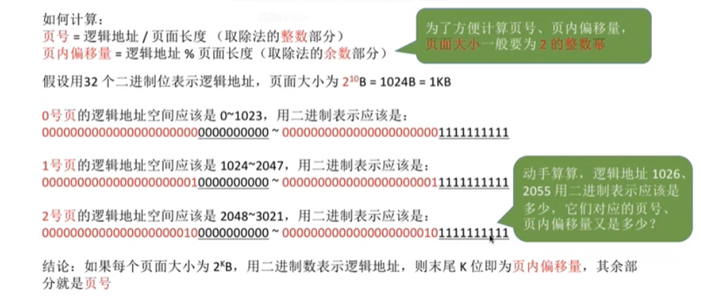 

                    * 结论：每个页面大小为2的k次方 B（byte），用二进制表示逻辑地址，则末尾k位则为页内偏移量，其余部
                            分就是页号

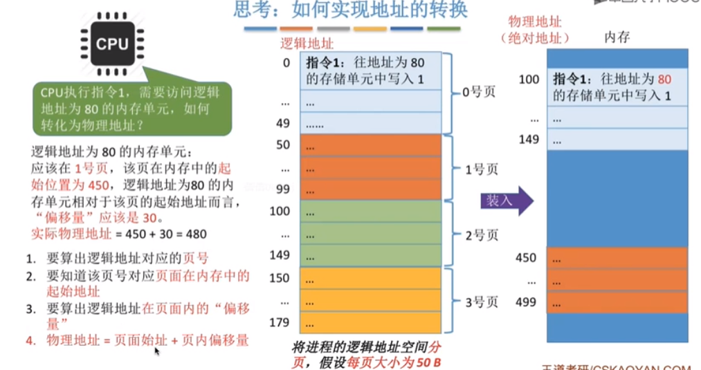     

                * 逻辑地址结构

 

                * 页表
                    * 为了能够知道每个页面中内存的位置，操作系统为每个进程都建立了一张页表

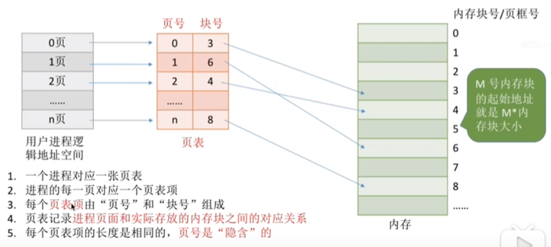 

                * 基本地址变换机构
                    * 概念：用于实现逻辑地址到物理地址转换的一组硬件机构

                    * 地址变换的过程：
                        1. 根据逻辑地址算出页号，页内偏移量
                        2. 页号的合法性检验（与页表长度对比）
                        3. 若页号合法，再根据页表起始地址，页号找到对应的页表项
                        4. 根据页表中记录的内存块号，页内偏移量得到最终的物理地址
                        5. 访问物理内存对应的内存单元

                    * 页表寄存器：存放页表内存中的起始地址和页表长度

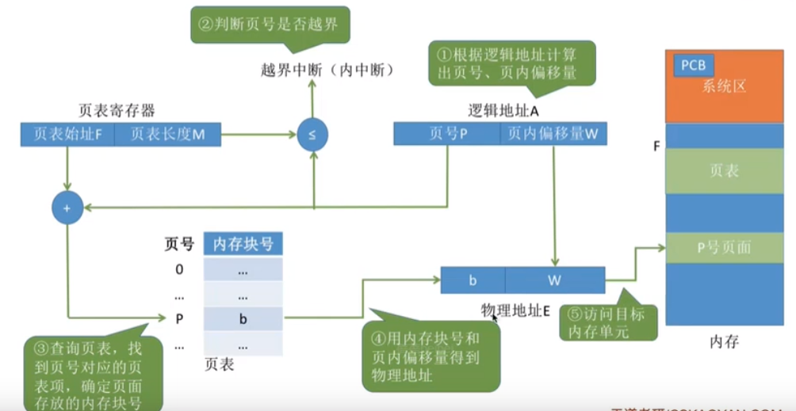 

                    * 注意：
                        * 页号与页面长度相等，也会发生越界中断（这是因为页号是从0开始的，而页表长度至少是1）
                        * 目标物理地址 = 页面大小 * 内存块号 + 页内偏移量
                        * 在分页存储管理（页式管理）的系统中，只要确定了每个页面大小，逻辑地址结构就确定了。因此页式管理中
                          的地址是一维的

                    * 区分概念：
                        * 页表长度：指的是这个页表中总共有几个页表项，即总共有几页                
                        * 页表项长度：指的是每个页表项占多大的内存空间
                        * 页面大小：指的是一个页面占多大的存储空间
                        
                * 具有快表的地址变换机构
                    * 局部性原理
                        * 时间局部性：（见下图）
                        * 空间局部性：（见下图）

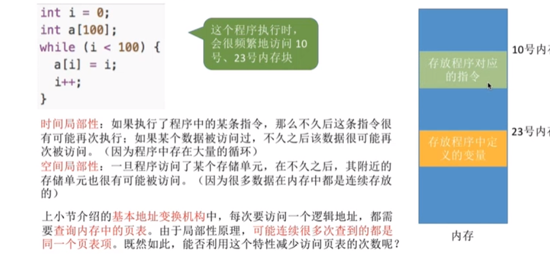 

                    * 快表
                        * 概念：快表又称为联想寄存器（TLB），是一种访问速度比内存快很多的高速缓冲存储器，用来存放当前访问的
                                若干页表项，以加速是指变换的过程。与此对应，内存中的页表常称为慢表
                        
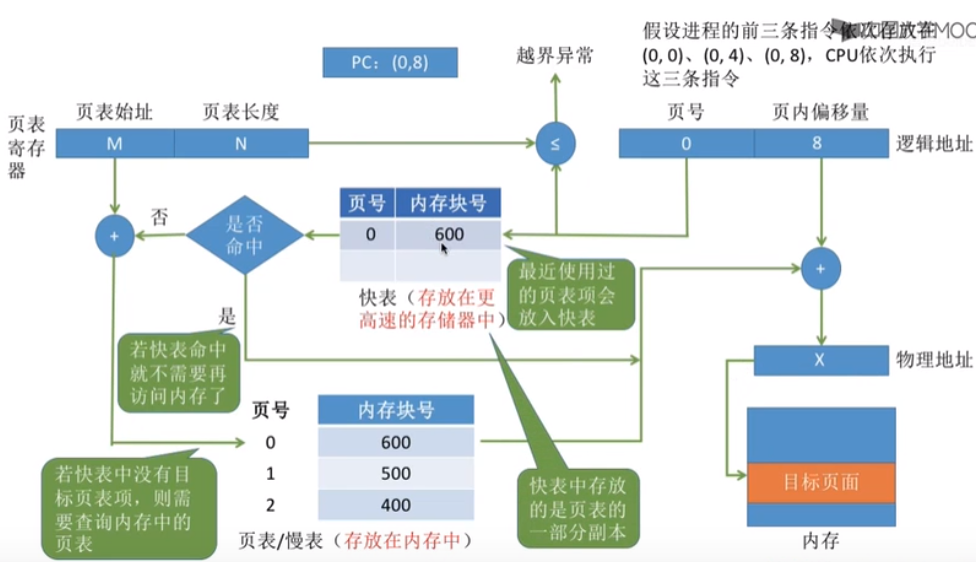                    
                        
                    * 引入快表后的地址转换机构的转换过程

                    * 未引入快表与引入快表的地址转换的对比

                * 两级页表
                    * 单级页表存在的问题
                        1. 根据页号查询页表的方法：页表需要连续存放，因此页表很大时，需要占用你多个连续的页框，违背了
                           非连续分配管理方式
                        2. 根据局部性原理，进程在一段时间内只需要访问某几个页面就可以正常运行。因此没有必要让整个页表
                           都常驻内存
                
                    * 解决方案
                        * 问题一：
                            * 思路：我们参照解决进程在内存中必须连续存储的问题的思路，将连续存放的页表进行再次分页

                            * 两级页表的原理和地址结构

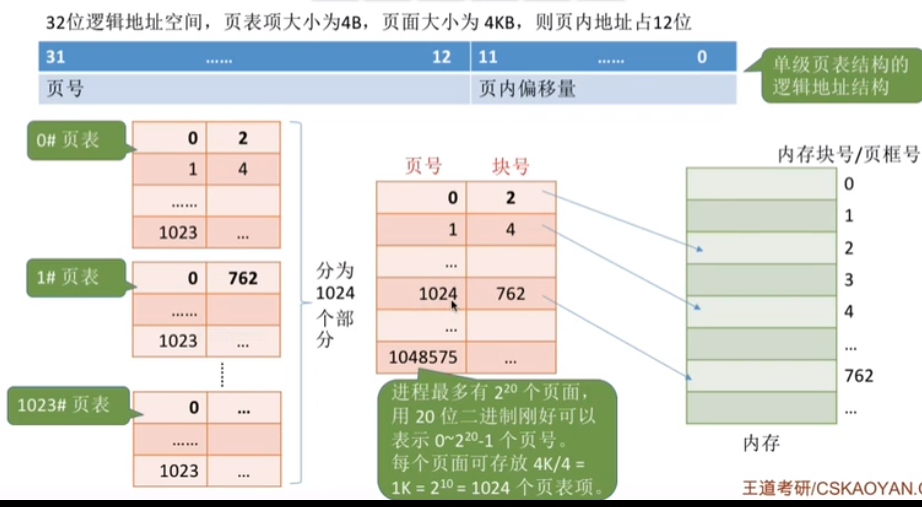
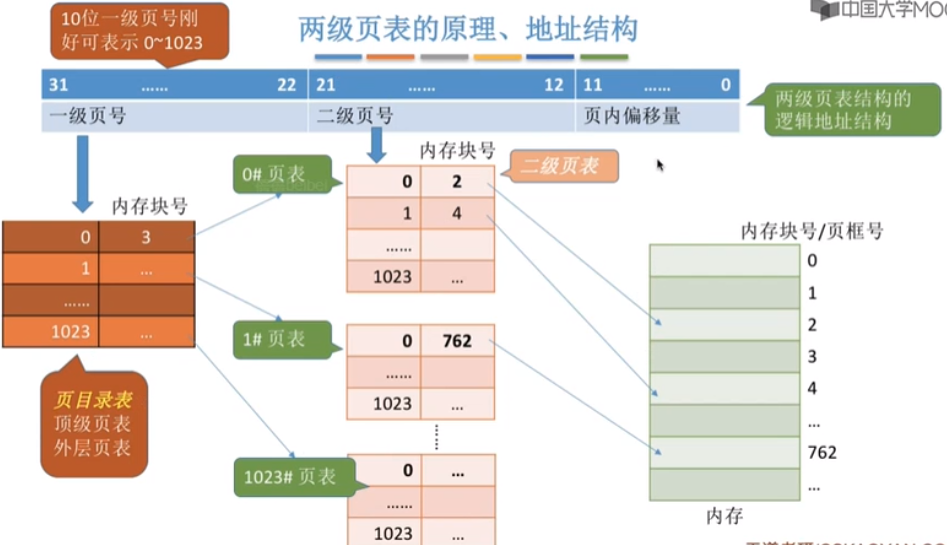

                            * 两级页表如何实现地址转换

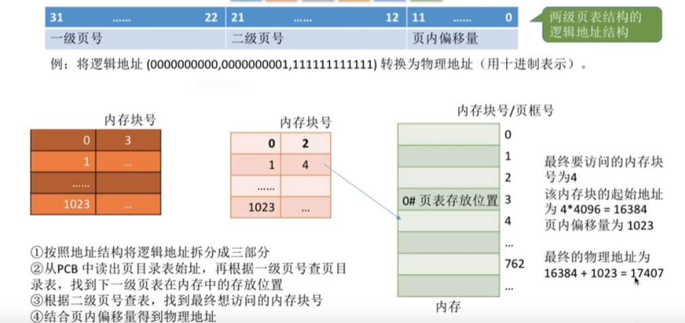

                        * 问题二：
                            * 思路：在需要访问页面时才把页面调入内存（虚拟存储技术），可以在页表项中增加一个标志位，
                                    用于表示该页面是否已经调入内存
                            
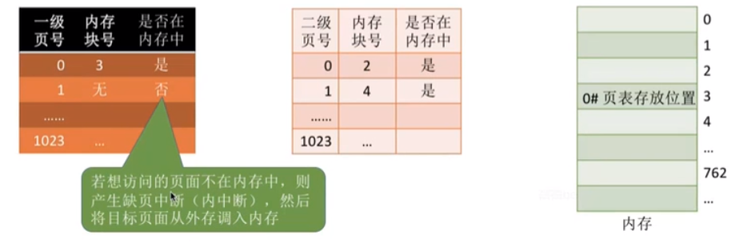

                        * 注意：
                            1. 若采用多级页表机制，各级页表的大小不能超过一个页面
                            2. 两级页表的访存分析（n级列表需要访问n + 1次）
                                第一次访存:访问内存中页目录表
                                第二次访存：访问内存中二级目录页表
                                第三次访存：访问目标内存单元
