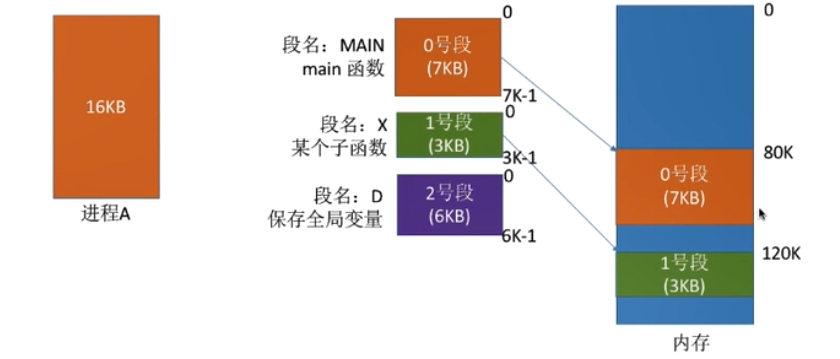
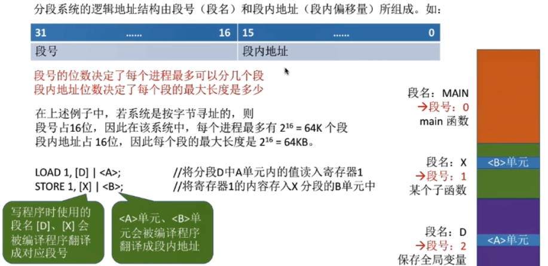
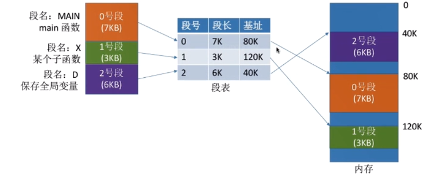
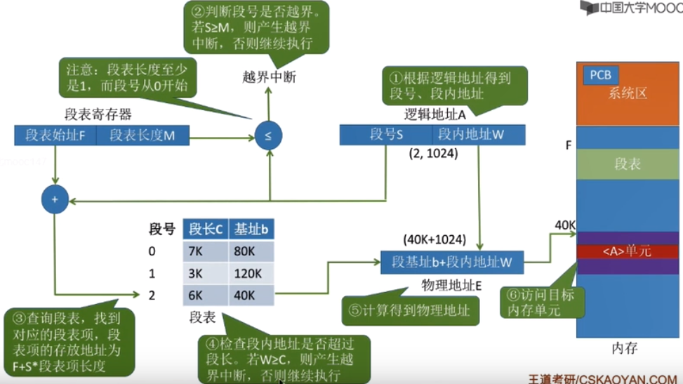
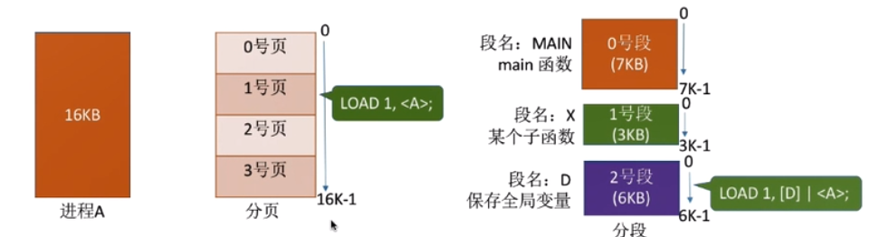
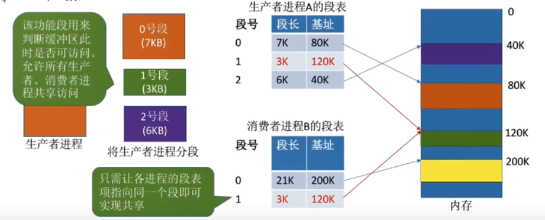
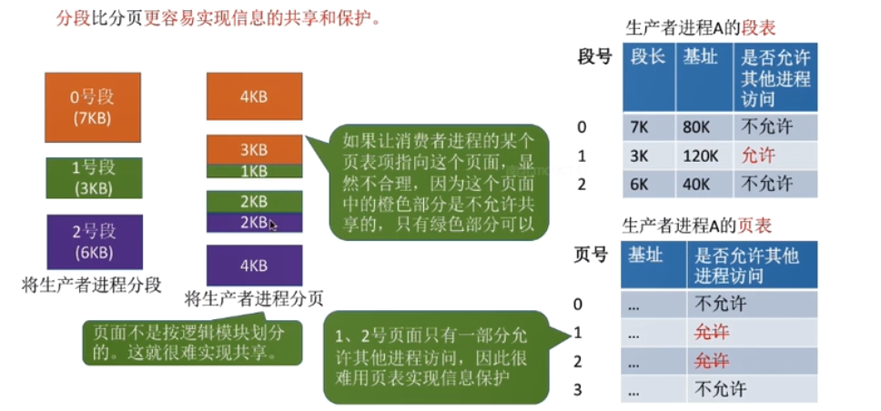
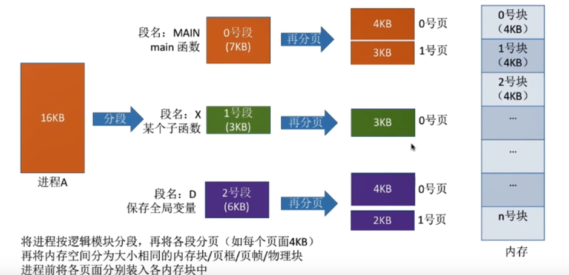
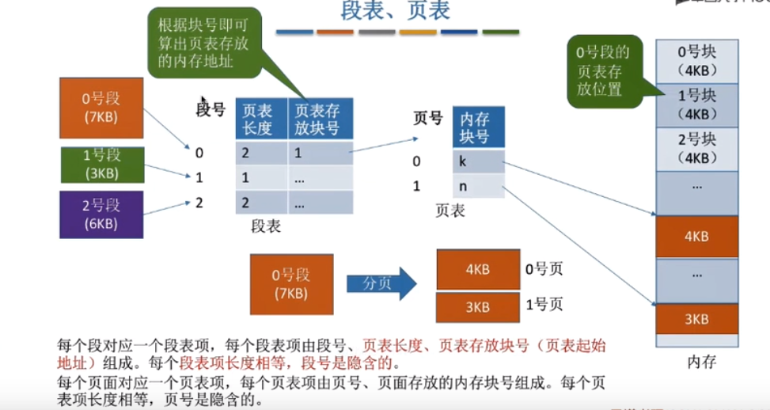
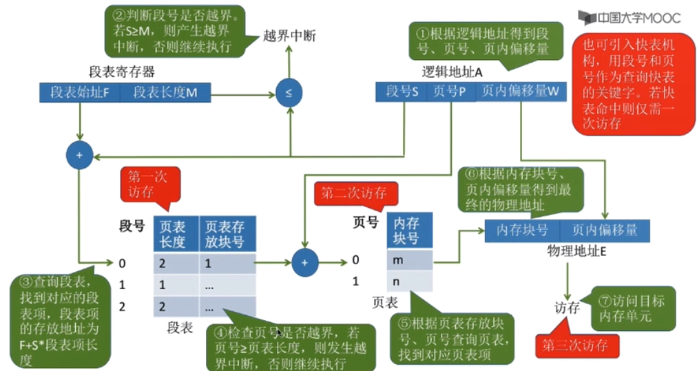

# 基本分段存储管理方式
    1.基本分段存储管理方式
        1. 分段
            * 概念：进程的地址空间按照程序的自身逻辑关系划分为若干个段，每个段都有一个段名（在低级语言中程序员使用段名来
                    进行编程），每段从0开始编址

            * 内存分配规则：以段为单位进行分配，每个段在内存中占据连续空间，当各段之间可以不相邻

        2. 段表
            * 概念：程序分多个段，各段离散的装入内存，为了保证程序能正常运行，就必须从物理内存中找到各个逻辑段的存放位置
                    为此，需要为每个进程建立一张映射表，简称“段表”
                
            * 注意：    
                1. 每个段对应一个段表项，其中记录了该段在内存中的起始位置（又称“基址”）和段的长度
                2. 各个段表项的长度是相同的。因此，段号可以是隐含的，不占存储空间。若段表存放地址为M那么K号对应的段表项
                存放的地址为M + K * 6

        3. 地址变换过程

        4. 分段、分页管理的对比
            * 页是信息的物理单位。分页的主要目的是为了实现离散分配，提高内存利用率。分页仅仅是系统管理上的需要，完全是
            系统行为，对用户是不可见的
            * 段是信息的逻辑单位。分段的主要目的是更好的满足用户需求。一个段通常包含着一组属于一个逻辑模块的信息。分段
            对用户是可见的，用户编程时需要显式的给出段名
            * 页的大小固定且由系统决定。段的长度却不固定，决定于用户编写的程序

            * 分页的用户进程地址空间是一维的，程序员只需要给出一个记忆符即可表示一个地址。
            * 分段的用户进程地址空间是二维的，程序员在标识一个地址时，急需要给出段名，也需要给出段内地址

            * 分段比分页更容易实现信息的共享与保护
            * 不能修改的代码称为纯代码或可重入代码（不属于临界资源），这样的代码是可以共享的可秀改的代码是不能够共享的
            （比如：有一个代码段中有很多变量，各进程并发的同时访问可能造成数据不一致）

            * 访问一个逻辑地址需要几次访存？
                * 分页（单级页表）：第一次访存---查内存中的页表，第二次访存---访问目标内存单元，总共两次
                * 分段：第一次访存---查内存中的段表，第二次访存---访问目标内存单元。总共两次
                * 注意：分段与分页类似，分段系统中也可以引入快表机构，将近期访问过的段表项放到快表中，这样可以少一次
                        访问，加快地址变换速度
            
    2. 段页式管理方式
        1. 分页、分段的优缺点分析
            * 分段管理中产生的外部碎片可以用“紧凑”技术来解决，但是付出的时间代价比较大

        2. 分页 + 分段 = 段页式管理

        3. 段页式管理的逻辑地址结构
            * 段号的位数决定了每个进程最多可以分几个段
            * 页号的位数决定了每个段最大有多少页
            * 页内偏移量决定了页面大小、内存块大小是多少
            * 注意：段页式管理的地址结构是二维的

        4. 段表、页表
            * 注意：
                1. 一个进程会对应一个段表，但是可能对应多个页表（这是由于段表中的段的长度可能需要分成多页）
                2. 段页式中的段表和分段管理中的段表结构是不一样的，在段页式中由段号、页表长度、页表存放地址组成，在
                   分段管理中由段号、段的长度、段的起始地址组成

        5. 段页式的逻辑地址转换为物理地址的过程
            * 注意：
                可以引入快表机构，以段号和页号为关键子查询快表，即可直接找到最终目标页面存放地址。引入块表后仅需要
                一次访存  

