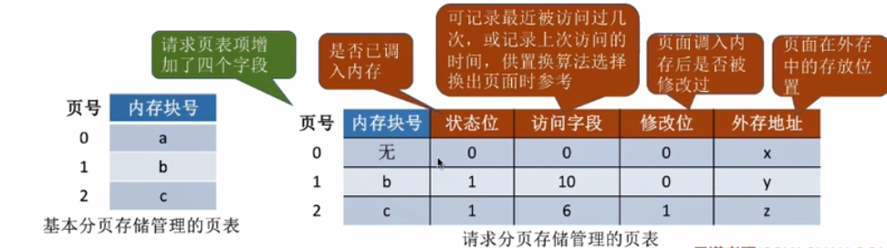

# 虚拟内存的基本概念和请求分页处理方式
    1. 虚拟内存的基本概念
        * 传统存储管理方式的特征、缺点
            1. 一次性：作业必须一次性全部装入内存后才能开始运行。这就会造成两个问题：
                <1> 作业很大时，不能全部装入内存，导致大作业无法运行
                <2> 当大量作业要求运行时，由于内存无法容纳所有作业，因此只有少量作业才能运行，导致多道程序并发度下降
            
            2. 驻留性：一旦作业被装入内存，就会一直驻留在内存中，直到作业运行结束。事实上在一个时间段内，只需要访问作
                      业的一小部分数据即可正常运行，这就导致了内存中会驻留大量的、暂时用不到的数据，浪费了宝贵的内存
                      资源

        * 局部性原理的应用

        * 虚拟内存的定义和特征
            1. 定义
                * 基于局部性原理，在程序装入时，可以将程序中很快会用到的部分装入内存，暂时用不到的部分会留在外存，就
                  可以让程序开始执行
                
                * 在程序执行过程中，当所访问的信息不在内存时，由操作系统负责将所需信息从外存调入内存，然后继续执行程序
                  若内存空间不够，由操作系统负责将内存中暂时用不到的信息换出外存。在操作系统的管理下，在用看来似乎有一
                  个比实际内存大得多的内存，这就是虚拟内存

            2. 特征
                * 多次性：无需在作业运行时一次性全部装入内存，而是允许被分成多次调入内存
                
                * 对换性：在作业运行时无需常驻内存，而是在作业运行过程中，将作业换入、换出

                * 虚拟性：从逻辑上扩充了内存的容量，使用户看到的内存容量，远远大于实际容量

        * 如何实现虚拟内存技术
            * 虚拟内存技术，允许一个作业分多次调入内存。如果采用连续的分配方式，会不便于实现，因此，虚拟内存的实现需要
              建立在离散分配的内存管理方式基础上
            
            * 传统的非连续分配存储管理与虚拟内存的区别：
                1. 在程序执行过程中，当所访问的信息不在内存时，由操作系统将所需的信息从外存调入内存，然后继续执行程序。
                   （此时，操作系统需要提供请求调页或请求调段的功能）
                   
                2. 若内存空间不够，由操作系统负责将内存中暂时用不到的信息换出到内存（此时操作系统需要提供页面置换或段
                    置换的功能）

    2. 请求分页管理方式
        * 页表机制
            1. 与基本页表管理相比，请求分页管理中，为了实现“请求调页”，操作系统需要知道每个页面是否已经调入内存，如果
               还没有调入内存，那也需要知道该页面在外存中存放的位置
            
            2. 当内存空间不够时，要实现“页面置换”，操作系统需要通过某些指标来决定到底换出哪一个页面，有的页面没有被修
               改过，就不用浪费时间写回外存。有的页面修改过，就需要将外存中的旧数据覆盖。因此操作系统也需要记录各个页
               面是否被修改的信息

        * 缺页中断机构
            1. 在请求分页系统中，每当要访问的页面不在内存时，便产生一个缺页中断，然后由操作系统的缺页中断处理程序处理
                中断。此时，缺页的进程阻塞，放入阻塞队列，调页完成后再将其唤醒，放回就绪队列。

            2. 如果内存块中有空闲块，则为进程分配一个空闲块，将所缺页面装入该快，并修改页表中相应的的页表项。如果内存
                块中没有空闲块，则由页面置换算法选择一个页面淘汰，若该页面在内存期间被修改过，则需要写回外存。未修改过
                的页面不用再写回外存

            3. 缺页中断是因为当前执行的指令想要访问的目标页面未调入内存而产生的，因此属于内中断

            4. 一条指令在执行期间，可能产生多次缺页中断。（如：copy A to B，即将逻辑地址A中的数据复制到逻辑地址B中，
               而A，B属于不同的页面，则有可能产生两次中断）
            
        * 地址变换机构
            1. 请求分页存储管理与基本分页存储管理的主要区别：
                * 在程序执行过程中，当所访问的信息不在内存时，由操作系统负责将所需的信息从外存调入内存，然后继续执行
                  程序

                * 注意：
                    * 在具有快表机构的请求分页系统中，访问一个逻辑地址时，若发生缺页地址变换的步骤：
                        查询快表（未命中）---查慢表（发现未调入内存）---调页（调入的页面对应的表项会直接加入快表）
                        ---查快表（命中）---访问目标内存单元
            

