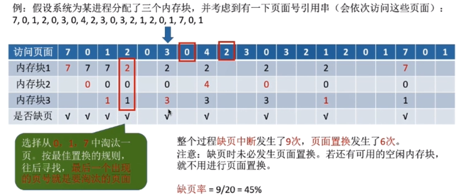
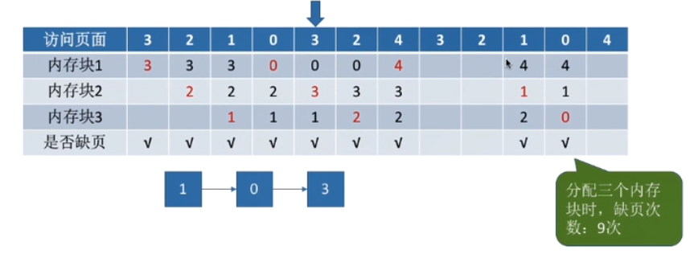
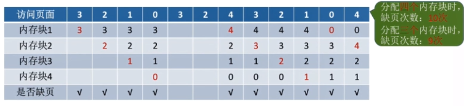
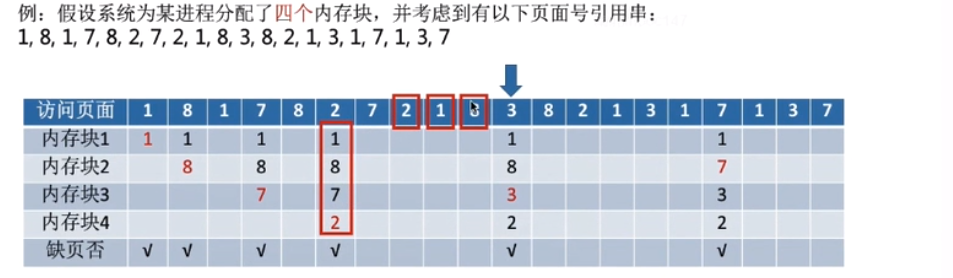
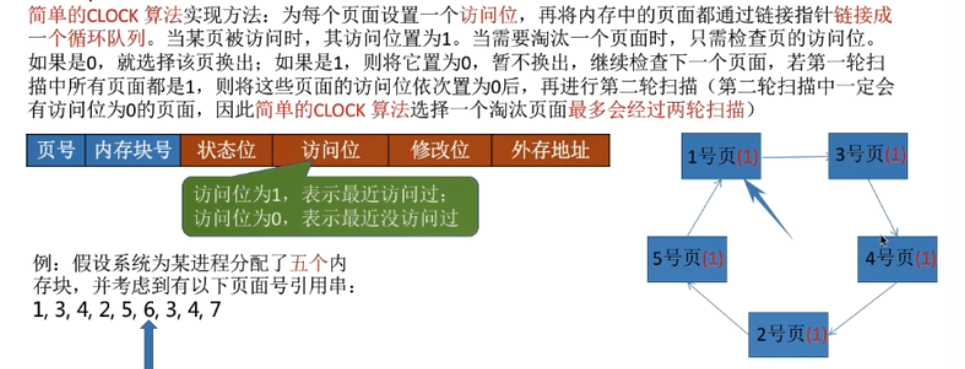
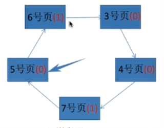
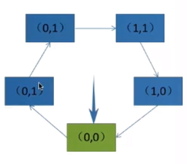
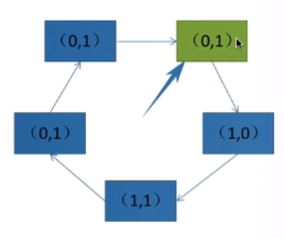
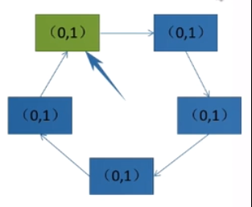
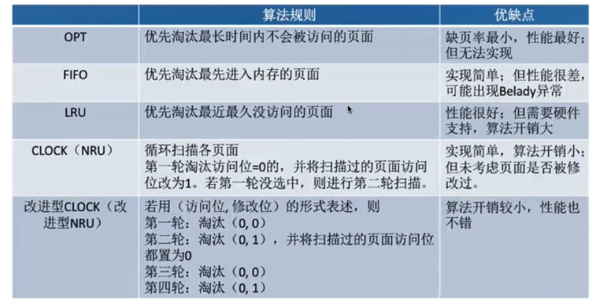

# 页面置换算法
    1. 最佳置换算法（OPT，Optimal）
        * 概念：每次选择淘汰的页面将是以后不使用，或者在长时间内不在被访问的页面，这样可以保证最低的缺页率

        * 最佳置换算法可以保证最低缺页率，但实际上，只有在进程执行过程中才能知道接下来会访问到的是哪个页面
          操作系统无法提前预判访问序列，因此，最佳置换算法是无法实现的
        

    2. 先进先出置换算法（FIFO）
        * 概念：每次选择淘汰的页面是最早进入内存的页面

        * 实现：把调入内存的页面根据调入的先后顺序排成一个队列，需要换出页面时，选择队头页面即可。
        
        * 注意：
            1. 队列的最大长度取决于系统为进程分配了多少内存块。
            2. 只有FIFO算法会产生Belady异常，另外，虽然FIFO实现起来简单，但是该算法与进程实际运行时的规律
                不适应，因为先进入的页面也有可能最经常被访问。因此，耍法性能差

        * Belady异常：当为进程分配的物理块数增大时，缺页次数不减反增的异常现象

        * 分配三个内存块的情况

        * 分配四个内存块的情况

    3. 最近最久未使用算法（LRU，least recently used）
        * 概念：每次淘汰的页面是最近最久未使用的页面

        * 实现：赋予每个页面对应的页表项中，用访问字段记录该页面自上次被访问以来，最久未使用的页面

        * 注意：最近最久未使用算法实现需要专门的硬件支持，虽然算法性能好（性能最好），但是实现困难，开销大

    4. 时钟置换算法（CLOCK）
        * 时钟置换算法是一种性能和开销较均衡的算法，又称为CLOCK算法或最近未用算法（NRU，Not Recently Used）

        * 简单的CLOCK算法的实现方式：见下图

  

    5. 改进型的CLOCK算法
        * 简单的时钟置换算法仅考虑到一个页面最近是否访问过。事实上，如果被淘汰的页面没有被修改过，就不需要
          执行I/O操作写回外存。只有被淘汰的页面被修改过时，才需要写回外存。

        * 改进CLOCK算法思想：除了考虑一个页面最近有没有被修改以外，操作系统还应该考虑页面有没有被修改过。
                            在其他条件相同时，应该优先淘汰没有修改过的页面，避免I/O操作
        
        * 修改位=0，表示页面没有修改过，修改位=1表示页面被修改过，下面我们用（访问位，修改位）的形式表示各
          页面状态

  

    6. 算法对比总结表

