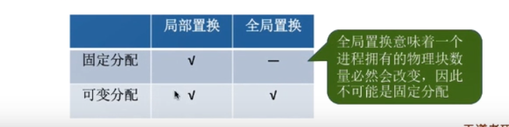
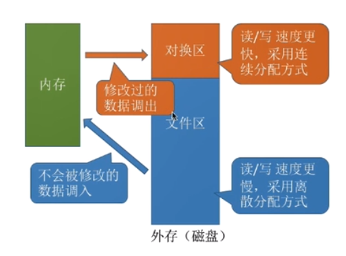
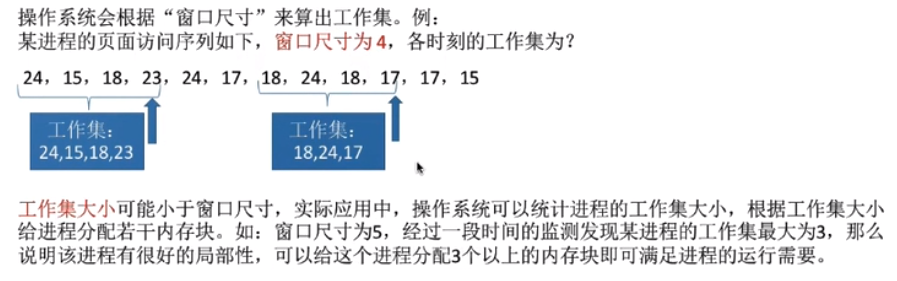

# 页面分配策略
    1. 页面分配、置换策略
        * 相关概念：
            1. 驻留集：指请求分页管理中给进程分配的物理块的集合
                * 在采用了虚拟存储技术的系统中，驻留集大小一般小于进程的总大小。若驻留集太小，会导致缺页频繁，
                  系统要花大量的时间来处理缺页，实际用于推进的时间很少。若驻留集太大，又会导致多道程序并发度
                  下降，资源利用率降低。所以应该选择一个合适的驻留集大小。

            2. 固定分配：操作系统为每个进程分配一组固定数目的物理块，在进程运行期间不再改变。即驻留集大小不变

            3. 可变分配：先为进程分配一定数目的物理块，在进程运行期间，可根据情况做适当的增加或减少。即驻留集
                        可变。
            
            4. 局部置换：发生缺页时只能选进程自己的物理块进行置换

            5. 全局置换：可将操作系统保留的空闲物理块分配给缺页进程，也可以将别的进程持有的物理块置换到外存，
                        再分配给缺页进程

        * 页面分配与置换结合的策略

            * 参考下图可知：只有三种组合策略，全局置换与固定分配并不能够组合在一起，这是因为全局置换进程拥有的
                            物理块必然会发生改变，而固定分配与之互斥

        * 三种页面分配的策略
            1. 固定分配局部置换：
                * 系统为每个进程分配一定数量的物理块，在整个运行期间都不会改变。若进程在运行中发生缺页，则只能
                  从该进程在内存中的页面中选出一页换出，然后再调入需要的页面。
                
                * 缺点：在刚开始时，很难合理分配物理块给进程（采用这种策略系统可以根据进程大小、优先级、或是
                        根据程序员给出的参数来确定为一个进程分配的内存块数）

            2. 可变分配全局置换：
                * 刚开始会为进程分配一定数量的物理块。操作系统会保持一个空闲物理块队列。当某进程发生缺页时，从
                  空闲物理块中取出一块分配给该进程，若已无空闲物理块，则可选择一个未锁定的页面换出外存，再将该
                  物理块分配给缺页进程。

                * 缺点：采用这种策略时，只要某进程发生缺页都将获得新的物理块，仅当空闲物理块用完时，系统才选定
                        一个未锁定的页面调出。被选定调出的页面可能是系统中任何一个页面，因此被选中的进程拥有的
                        物理块会减少，缺页率会增加。

            3. 可变分配局部置换
                * 刚开始会为每个进程分配一定数量的物理块，当某进程发生缺页时，只允许从该进程自己的物理块中选出
                  一个进行换出外存。如果进程在运行中频繁的缺页，系统会为该进程多分配几个物理块，直到该进程缺页
                  率趋势适当程度。反之，如果在进程运行中缺页率特别低，则可适当减少分配给该进程的物理块

            
            4. 注意：可变分配全局置换，只要缺页就分配给新的物理块。可变分配局部置换，要根据发生的缺页频率来动态
                    的增加或减少进程的物理块

        * 何时调入页面
            1. 预调页策略：根据局部性原理，一次调入若干个相邻的页面可能比一次调入一个页面更高效。但是如果提前调
                          入的页面中大多数都没有被访问过，则又是低效的。这种策略主要用于进程的首次调入，由程序
                          员指出应该先调入哪些部分（运行前调入）
            
            2. 请求调页策略：进程在运行期间发现缺页时才将所缺的页面调入内存。由这种策略调出的页面一定会被访问到
                            但由于每次只能调入一页，而每次调页都要进行I/O操作，一次I/O操作开销比较大（运行时调
                            入）

        * 从何处调入页面
            1. 系统拥有足够的对换区空间：
                * 页面的调入、调出都是在内存与对换区之间进行的，这样可以保证页面的调入、调出速度更快。在进程运行
                  前，需要将进程相关的数据从文件区复制到对换区

            2. 系统缺少足够的对换区空间：
                * 凡是不会被直接修改的数据都直接从文件区调入，由于这些页面不会被修改，因此换出时不需要写回磁盘
                  下次需要时，直接冲个文件区直接调入即可。对于可能被修改的部分，换出时，需要写回磁盘对换区，下次
                  需要时，再从对换区调入

            3. UNIX方式;
                * 运行之前进程有关的数据全部放在文件区，故未使用过的页面，都可从文件区调入。若使用过的页面需要换出
                  则写回兑换区，下次需要时从对换区调入

        * 抖动（颠簸）现象
            1. 概念：刚刚换出的页面，马上又要换入内存，刚刚换入内存的页面又马上需要换出外存，这种频繁的页面调度行为
                    称为抖动。
            
            2. 产生的主要原因:进程频繁的访问页面数目高于可利用的物理块数（分配给进程的物理块不够）

        * 工作集
            1. 概念：指在某段时间间隔里，进程实际访问的页面的集合

            2. 一般来说，驻留集的大小不能小于工作集，否则进程运行过程中将频繁缺页

            