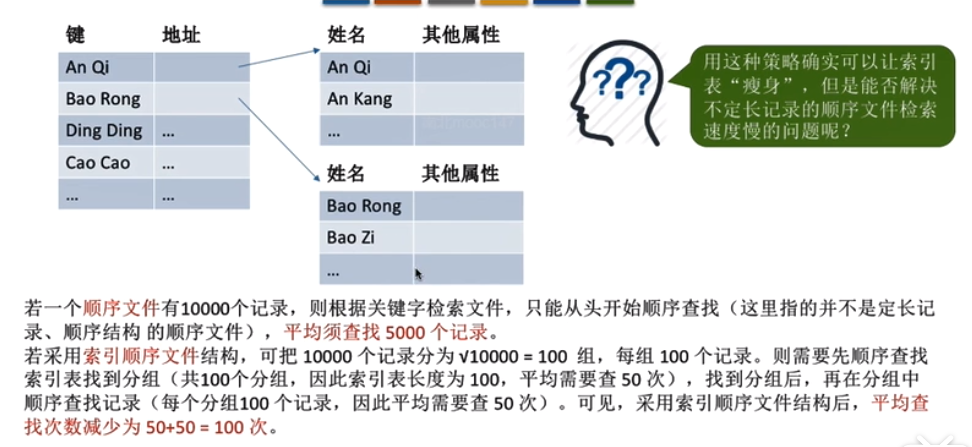

# 文件系统基础
## 文件管理概述
        1. 定义：一组有意义的信息的集合

        2. 文件的属性
            * 文件名：由创建文件的用户决定文件名，主要是为了方便用户找到文件，同一目录下不允许有重名文件

            * 标识符：一个系统内的各文件标识符唯一，对用户来说毫无可读性，因此，标识符只是操作系统用于区分各个文件
                    的一种内部名称
            
            * 类型：指明文件类型

            * 位置：文件存放的路径（让用户使用）、在外存中的地址（操作系统使用，用户不可见）

            * 大小：指明文件大小

            * 保护信息：对文件进行保护的访问控制信息
            
        3. 文件的分类（文件内部通过文件的逻辑结构组织起来）
            * 无结构文件（如文本文件）：由一些二进制或字符流组成，又称“流式文件”
            
            * 有结构文件（如数据库表）：由一组相似的记录组成，又称“记录式文件”

        4. 文件之间应该如何被组织起来（目录结构）

        5. 操作系统向上应该提供那些功能

        6. 文件如何存放在外存中

        7. 操作系统如何管理外存中的空闲块（存储空间的管理）

        8. 操作系统需要提供的其他文件管理功能
            * 文件共享
            * 文件保护

## 文件的逻辑结构

        1. 相关概念：
            * 逻辑结构：是指在用户看来，文件内部的数据应该是如何让组织起来的。
            * 物理结构：是指在操作系统看来，文件的数据是如何存放在外存中的。

        2. 有结构文件
            * 每条记录有若干个数据项组成。一般来说，每条记录有一个数据项可作为关键字。根据各条记录的长度（占用的存
              储空间）是否相等，又可分为定长记录和可变长记录

            * 包括：顺序文件、索引文件、索引顺序文件

        3. 顺序文件
            * 顺序文件：文件中的记录一个接着一个顺序的排列（逻辑上），记录可以是定长的也可以是可变长的，各个记录在
                        物理上可以顺序存储或链式存储    

            * 顺序文件的缺点：增加/删除一个就比较困难（如果是串结构相对简单）

        4. 索引文件

        5. 索引顺序文件
            * 索引顺序文件是索引文件和顺序文件思想的结合。索引顺序文件中，同样会为文件创建一张索引表，但不同的是：并
              不是每条记录对应一个索引表项，而是一组记录对应一个缩影表项

## 文件目录

        1. 文件控制块（实现文件目录的关键数据结构）
            * 目录文件中的一条记录就是一个“文件控制块(FCB)”

            * FCB的有序集合称为“文件目录”，一个FCB就是一个文件目录项。

            * FCB中包含了文件的基本信息（文件名、物理地址、逻辑结构、物理结构等），存取控制信息（是否可读/可写、禁止
              访问用户名单等），使用信息（如文件的建立时间、修改时间等）。其中最基本的、最重要的是文件名、文件存放的
              物理地址

            * 需要对文件目录进行哪些操作？
                1. 搜索：单一个用户使用一个文件时，系统要根据文件名搜索目录，找到该文件对应的目录项
                2. 创建文件：创建一个新文件时，需要在其所属的目录中增加一个目录项
                3. 删除文件：当删除一个文件时，需要在目录中删除相应的目录项
                4. 显示目录：用户可以请求显示目录中的内容，如显示该目录中的所有文件及相应的属性
                5. 修改目录：某些文件属性保存在目录中，因此这些属性变化时需要修改相应的目录项（如：文件重命名）

        2. 目录结构
            * 单级目录结构
                * 一个系统只有一张目录表，不允许文件重名

            * 两级目录结构
                * 不同用户的文件可以重名，但是不能对文件进行分类

            * 多级（树形）目录结构
                * 不同目录下的文件可以重名，可以对文件进行分类，层次结构清晰，也能够有效的进行文件管理和保护，但是不
                  方便文件共享
                * 系统从文件路径找到目标文件
                * 从根目录触发的路径是“绝对路径”
                * 从当前目录出发的路径是“相对路径”

            * 无环图目录结构
                * 在树形目录结构的基础上，增加指向同一节点的有向边，使整个目录称为一个有向无环图
                * 为共享节点设置一个共享计数器，计数器为0时，才真正删除该节点

        3. 索引结点
            * 除了文件名之外，所有信息（包括文件在外存中的存放位置）都放到索引结点中，每个文件对应一个索引结点

            * 存放在外存中的索引结点称为“磁盘索引节点”，当索引结点放入内存后称为“内存索引结点”

            * 目录项中只包含文件名、索引结点指针，因此每个目录项的长度大幅减少

            * 由于目录项长度减少，因此每个磁盘块可以存放更多个目录项，因此检索文件爱你时的I/O的次数就少了很多

              

