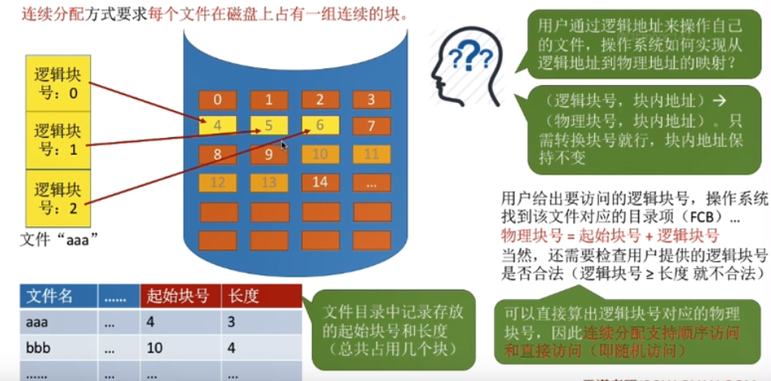
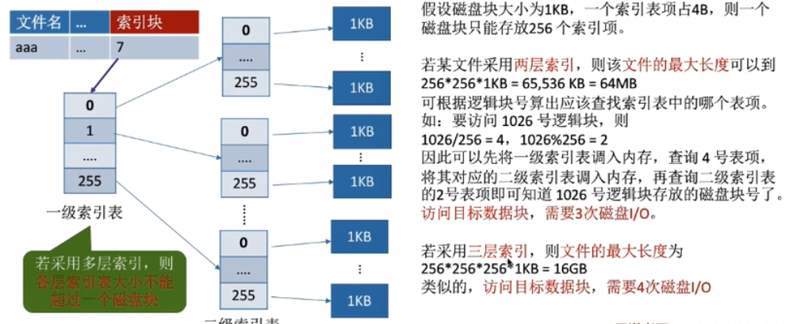

# 文件系统

## 文件的物理结构（文件分配方式）

    1. 文件块、磁盘块

    2. 文件分配方式--连续分配
        * 连续分配方式要求每个文件在磁盘上占有一组连续的块

        * 优点：支持顺序访问和直接访问（即随机访问），连续分配的文件在顺序访问时速度最快

        * 缺点：不方便文件拓展，存储空间利用率低，会产生磁盘碎片（可以通过紧凑技术解决，但是耗费时间代价很大）

    3. 文件分配方式--链接分配
        * 隐式链接
            * 除文件最后一个盘块之外，每个盘块中都存有指向下一个块盘的指针。文件目录包括包括文件第一块的指针和最后
              一块的指针。
            
            * 优点：很方便文件拓展，不会有碎片问题，外存利用率高

            * 缺点：只支持顺序访问，不支持随机访问，查找效率低，指向下一个盘块的指针也需要消耗少量的存储空间

        * 显示连接
            * 把用于链接文件各个物理块的指针显示的存放在一张表中。即文件分配表（FAT，File Allocation Table）。
              一个磁盘只会建立一张文件分配表。开机时，文件分配表放入内存，并常驻内存

            * 优点：很方便文件拓展，不会有碎片问题，外存利用率高，并且支持随机访问。相比于隐式链接来说，地址转换时
                    不需要访问磁盘，因此文件的访问效率较高

            * 缺点：文件分配表需要占用一定的内存空间

    4. 文件分配方式--索引分配
        * 索引分配允许文件离散地分配在各个磁盘块中，系统会为每个文件建立一张索引表，索引表中记录了文件的各个逻辑块
          对应的物理块（索引表的功能类似于内存管理中的页表--建立逻辑页面到物理页面之间的映射关系）。索引表存放的磁
          盘块称为索引块，文件数据存放的磁盘块称为数据块

        * 问题：文件太大，索引表项太多，会导致存储不下。我们可以通过三种方法解决
            1. 链接方案：如果索引表太大，一个索引块装不下，那么可以将多个索引块链接起来存放。
                * 缺点：若文件很大索引表很长，就需要将很多个索引块链接起来。想要找到i号索引块必须先依次读入i~i-1
                        号索引块，这就导致磁盘I/O次数过多，查找效率低下

                      
            2. 多层索引：建立多层索引（原理类似于多级页表）。使第一层索引块指向第二层索引块。还可以根据文件大小的
                        需求简练第三、第四层索引块。采用k层索引结构，且顶级索引表未调入内存，则访问一个数据块则需
                        要库k + 1次读磁盘操作。
                * 缺点：即使是小文件，访问数据依然需要k + 1次读磁盘

            3. 混合索引：多种索引分配方式的结合。例如，一个文件的顶级索引表中，既包含直接地址索引（直接指向数据块）
                        又包含一级间接索引（指向单层索引表）、还包含两级间接索引（指向两层索引表）
                * 优点：对于小文件来说，访问一个数据块所需的读磁盘次数更少

    5. 文件分配方式的对比总结

## 文件系统的实现（文件存储空间管理）

    1. 存储空间的划分与初始化

    2. 文件存储管理法--空闲表法（只适用于连续分配）
        * 空闲表中记录每个连续空闲区的起始盘块号、盘块数

        * 分配时，可采用首次适应、最佳适应等策略，回收时需要注意表项的合并问题

    3. 文件存储管理法--空闲链表法
        1. 空闲盘块链
            * 以盘块为单位组成一条空闲链

            * 分配时，从链头依次取出空闲块，回收时将空闲块插到链尾

        2. 空闲盘区链
            * 以盘区为单位建立一条空闲链

            * 分配时，可采用首次适应、最佳适应等策略，回收时需要注意表项的合并问题

    4. 文件存储管理法--位示图法（连续分配和离散分配都适用）
        * 一个二进制位对一个盘块，（字号，位号）或（行号，列号）与盘块号一一对应

        * 分配：
            若文件需要k个块，（这里0表示盘块未分配，1表示盘块已分配）
            <1> 顺序扫描位示图，找到k个相邻过不相邻的“0”
            <2> 根据字号、位号算出对应的盘块号，将相应的盘块号分配给文件
            <3> 将相应位设置为“1”

        * 回收：
            <1> 根据回收的盘块号计算出对应的字号、位号
            <2> 将相应的二进制位设置为“0”

        * 注意：
            * 二进制位中0/1到底哪个表示空闲，哪个表示不空闲
            * 字号、位号、盘块号到底是从0开始还是从1开始

    5. 文件存储管理法--成组链接法
        * UNIX采用的策略，适合大型文件系统

        * 文件卷的目录区中专门用一个磁盘块作为“超级块”，当系统启动时需要将超级块读入内存。并要保证内存与外存中的“超
          级块”数据一致

        * 分配：（假定超级块的数量为100）
            1. 需要1个空闲块
                <1> 检查第一个分组的块数是否足够。显然是足够的
                <2> 分配第一个分组中的1个空闲块，并修改相应数据

            2. 需要100个空闲块
                <1> 检查第一个分组的块数是否足够。显然是足够的
                <2> 分配第一组中的100个空闲块。但是由于300号块内存放了下一组的信息，因此300号块的数据需要复制到超级
                    块中

        * 回收：
            1. 如果第一个分组没有满，那么直接将需要回收的块插到第一组中

            2. 如果第一个分组满了，将要回收的块作为一个新的分组回收。需要将超级块中的数据复制到新回收的块中，并修改超
               级块的内容，让新回收的块成为第一个分组

## 文件系统的层次结构

    1. 文件系统的层次结构图

    2. 举例辅助理解文件系统的层次结构
        * 假设用户请求删除文件"D:/xxx/XXX/XXX"中的最后100条记录
            <1> 用户需要通过操作系统提供的接口发出删除的请求---用户接口

            <2> 由于用户提供的是文件的存放路径，因此操作系统需要一层一层地查找目录，找到对应的目录项---文件目录系统

            <3> 不同的用户对文件有不同的操作权限，因此为了保证安全，需要检查用户是否有访问权限---存取控制模块（存取
                控制检验层） 
            
            <4> 验证了用户的访问权限之后，需要把用户提供的“记录号”转变为对应的逻辑地址---逻辑文件系统与文件信息缓冲区

            <5> 知道了目标记录对应的逻辑地址后，还需要将逻辑地址转换为物理地址---物理文件系统

            <6> 要删除这条记录，必定要对磁盘设备发出请求---设备管理程序模块

            <7> 删除这些记录后，会有一些盘块空闲，因此需要将这些盘块收回---辅助分配模块

