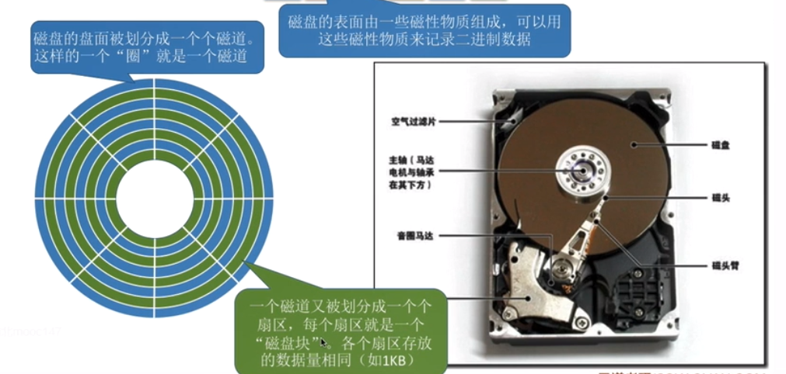
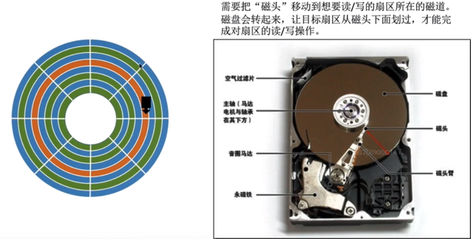
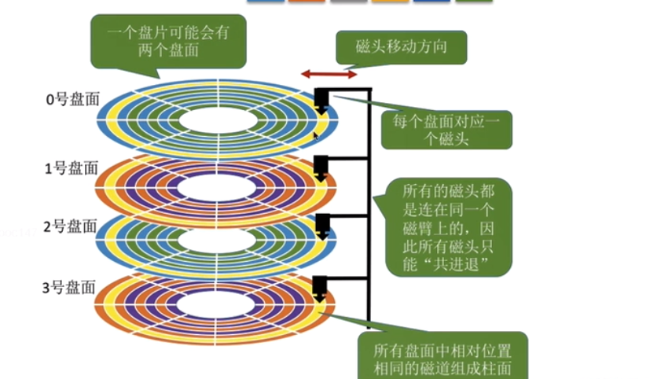
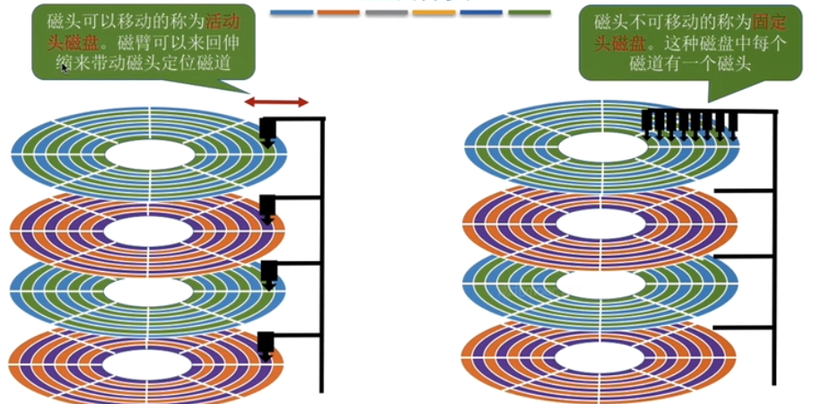
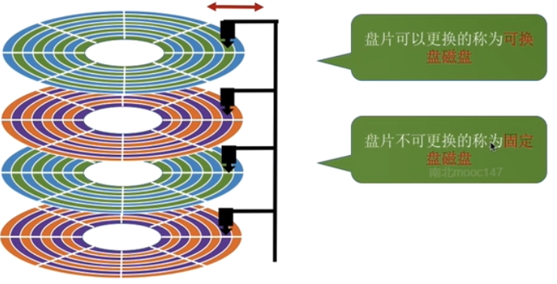
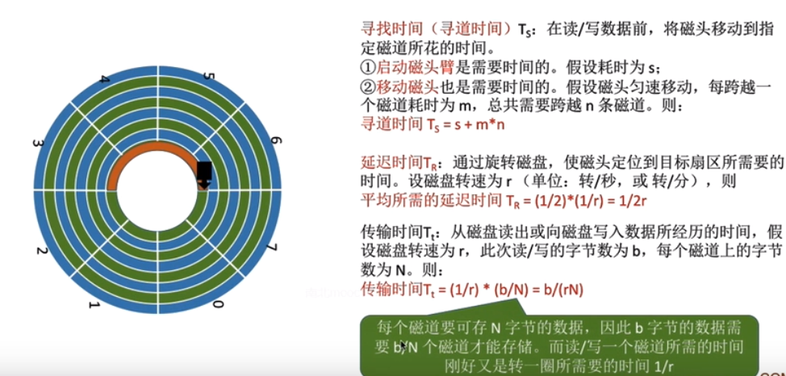
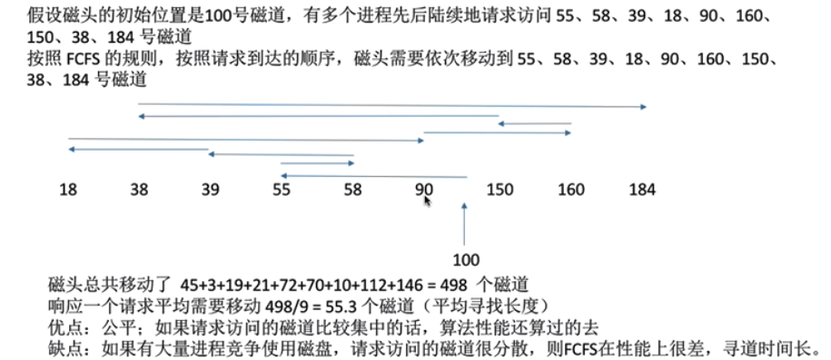
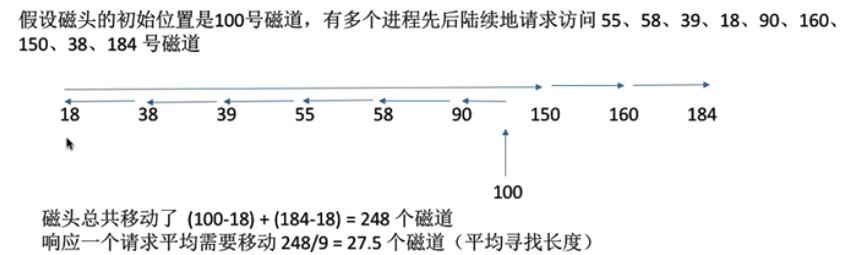

# 磁盘的组织与管理

## 磁盘的结构
    1. 磁盘、磁道、扇区的概念
        * 磁盘由表面涂有磁性物质的圆形盘片组成

        * 每个盘片划分为一个个磁道，每个磁道又划分为一个个扇区

    
    2. 如何在磁盘中读/写数据
        * 磁头移动到目标位置，盘片旋转，对应扇区划过磁道才能完成读写

    3. 盘面、柱面的概念
        * 磁盘由多个盘片“摞”起来，每个盘片有两个盘面

        * 所有盘面中相对位置相同的磁道组成柱面

    4. 磁盘的物理地址
        * 利用柱面号、盘面号、扇区号来定位任意一个“磁盘块”

        * 之前，提到的存放在外存中的块号，可以用于转换成（柱面号、盘面号、扇区号）的地址形式，然后根据地址形式就能读取
          一个“块”
            <1> 根据“柱面号”移动磁臂，让磁头指向指定的柱面
            <2> 激活指定盘面对应的磁头
            <3> 磁盘旋转过程中，指定的扇区会从磁头下面划过，就这样完成了对指定扇区的读写

    5. 磁盘的分类
        * 根据磁头是否可移动分类
            1. 固定头磁盘（每个磁道有一个磁头）

            2. 移动头磁盘（每个盘面只有一个磁头）

        * 根据盘面是否可更换分类
            1. 固定盘磁盘

            2. 可换盘磁盘

## 磁盘调度算法
    1. 一次磁盘读/写操作需要的时间
        * 寻找时间（寻道时间）：启动磁臂，移动磁头所花的时间（磁盘调度算法影响的指标）

        * 延迟时间：将目标扇区转到磁头下面所花的时间

        * 传输时间：读/写数据所花费的时间

        * 注意：延迟时间与传输时间都与磁盘转速相关，且为线性相关，而转速是硬件固有属性，因此操作系统也无法优化延迟时间
                和传输时间

    2. 磁盘调度算法
        * 先来先服务（FCFS）
            * 按请求访问先后到达的顺序进行处理

        * 最短寻找时间优先（SSTF）
            * 每次优先响应举例磁头最近的磁道访问请求

            * 与贪心算法思想一样，能保证眼前最优，但是无法保证总的寻道时间最短

            * 缺点：如果两个相邻磁道键都不断有源源不断的信号进入，可能导致“饥饿”（其他磁道的请求不能被接收）

        * 扫描算法（电梯算法、scan）
            * 只有磁头移动到最边缘的磁道时才可以改变磁头移动方向

            * 缺点：对各个位置磁道的响应频率不平均

        * 循环扫描算法（C-SCAN）
            * 只有磁头朝某个方向移动时才会响应请求，移动到边缘后立即让磁头返回起点，返回途中不响应任何请求

        * LOOK算法：
            * SCAN算法的改进，只有在磁头移动方向上不再有请求，就立即改变磁头方向

        * C-LOOK算法
            * C-SCAN算法的改进，只要磁头移动方向上不再有请求，就立即让磁头返回
