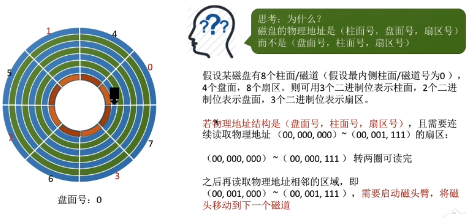
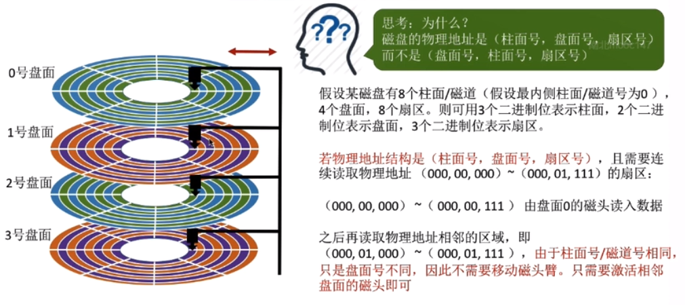
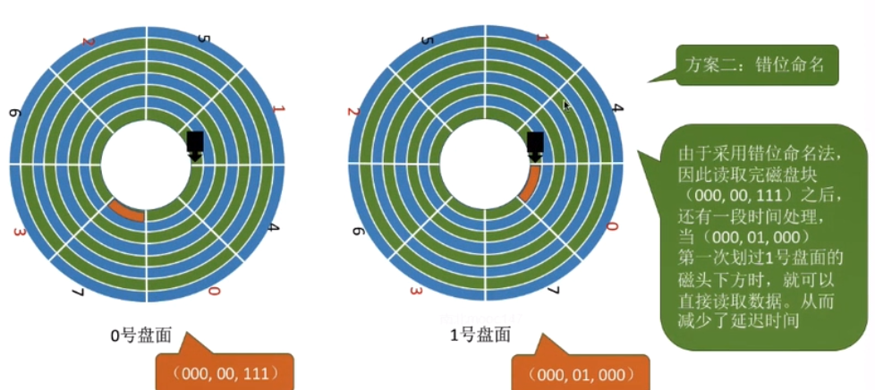

# 减少延迟时间的方法与磁盘管理

## 减少延迟时间的方法
    1. 减少延迟时间方法：交替编号
        * 采用交替编号的策略，即让逻辑上的扇区在物理上有一定的时间间隔，可以使读取连续的扇区所需要的延迟时间
          更小（当读取两个相邻的扇区中的磁道时，消耗了更多的磁头准备时间，而交替编号解决了这一个问题）

        * 做法：让编号相邻的扇区在物理上不相邻

        * 原理：读取完一个扇区后需要一段时间处理才可以继续读取下一个扇区

    2. 磁盘地址结构的设计
        

    3. 减少延迟时间的方法：错位命名
        * 做法：让相邻盘面的扇区编号“错位”

        * 原理：与“交替编号”的原理相同。“错位命名法”可降低延迟时间

## 磁盘管理
    1. 磁盘初始化
        * 第一步：进行低级格式化（物理格式化），将磁盘的各个磁道划分为扇区。一个扇区通常可分为头、数据区域、
          尾三个部分组成，管理扇区所需要的各种数据结构一般存储在头、尾两个部分包括扇区检验码（如奇偶校验等，
          检验码一般用于校验扇区中的数据是否发生错误）

        * 第二步：将磁盘分区，每个分区由若干个柱面组成（即C盘，D盘这些）
        
        * 第三步：进行逻辑格式化，创建文件系统，包括创建文件系统根目录、初始化存储空间管理所需要的数据结构（
          位示图、空闲分区表）

    2. 引导块
        * 计算机在开机时需要一系列的初始化工作，这些初始化工作是通过初始化程序（自举程序）完成的

        * ROM：初始化程序可以放在ROM（只读存储器）中，ROM中的数据在出厂时就写入了，并且以后不能再修改（ROM
          一般是出厂时就集成在主板上）

        * 注意：现在计算机中，ROM中只存放很小的“自举装入程序”，在开机时计算机先运行“自举装入程序”，通过执行
                该程序就可以找到引导块，并将完整的“自举程序”读入内存，完成初始化

        * 完整的自举程序存放在磁盘的启动块（引导块/启动分区）上，启动块位于磁盘的固定位置（拥有启动分区的磁
          盘称为启动磁盘或系统磁盘（C盘））

    3. 坏块的管理
        * 坏块：无法正常使用的扇区，这属于硬件故障，操作系统是无法修复的，应该将坏块标记出来，以免错误的使用
                它
        
        * 对于简单的磁盘，可以在逻辑格式化时（建立逻辑系统时）对整个磁盘进行坏块检查，标明哪些扇区是坏扇区，
          比如：在FAT表上标明。（在这种方式中，坏块对操作系统不透明）

        * 对于复杂的磁盘，磁盘控制器（磁盘设备内部的一个硬部件）会维护一个坏块链表。

        * 在磁盘出厂前进行低级格式化（物理格式化）时就将坏块链进行初始化。同时会保留一些“备用扇区”，用于替换
          坏块。这种方案称为扇区备用、且这种处理方式中，坏块对操作系统透明

          

