# IO控制器与IO控制方式

## IO控制器
    1. IO设备的机械部件
        * IO设备的机械部件主要用于来执行具体的IO操作，如：鼠标、键盘的按钮，显示器的LED屏，移动的磁盘的磁臂以及磁盘
          盘面

    2. IO设备的电子部件（IO控制器）
        * CPU无法直接控制IO设备的机械部件，因此IO设备还要有一个电子部件作为CPU和IO设备机械部件之间的“中介”，用于实
          现CPU对设备的控制，而这个部件就是IO控制器，又称设备控制器。CPU可控制IO控制器，又由IO控制器来控制设备的机
          械部件
        
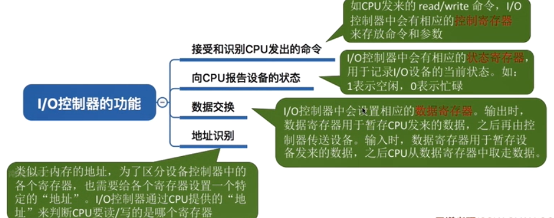

    3. IO控制器的组成
        * CPU与控制器之间的接口（实现控制器与CPU之间的通信）

        * I/O逻辑（负责识别CPU发出的命令，并向设备发出命令）

        * 控制器与设备之间的接口（实现控制器与设备之间的通信）

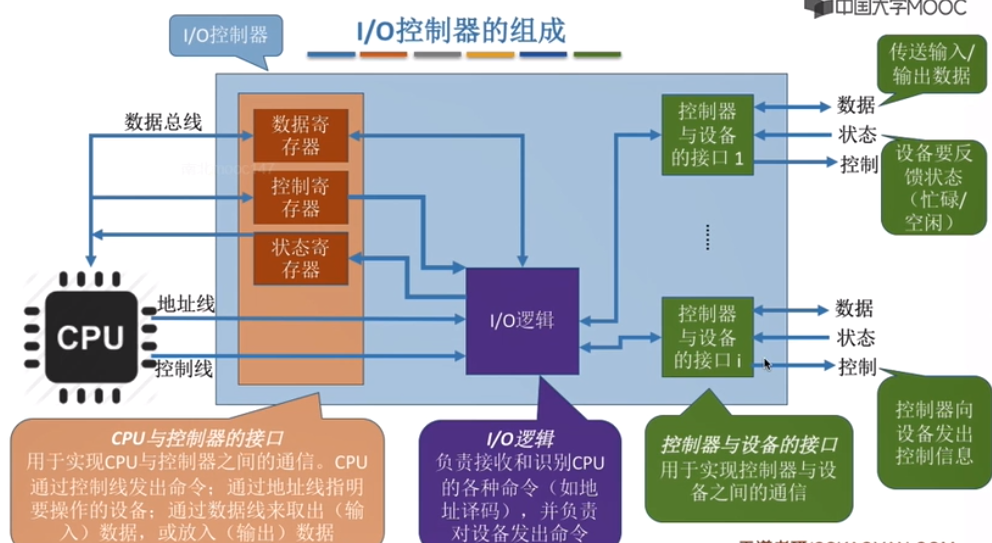

        * 注意：
            1. 一个IO控制器可以对应多个设备

            2. 数据寄存器、控制寄存器、状态寄存器可能有多个（如：每个控制/状态寄存器对应一个具体的设备）且这些寄存器
               都有相应的地址，才能方便CPU操作。有的计算机会让这些寄存器占用内存地址的一部分，称为内存映像I/O，另一些
               计算局则采用I/O专用地址，即寄存器独立编址

    4. 内存映像I/O与寄存器独立编址的对比
    
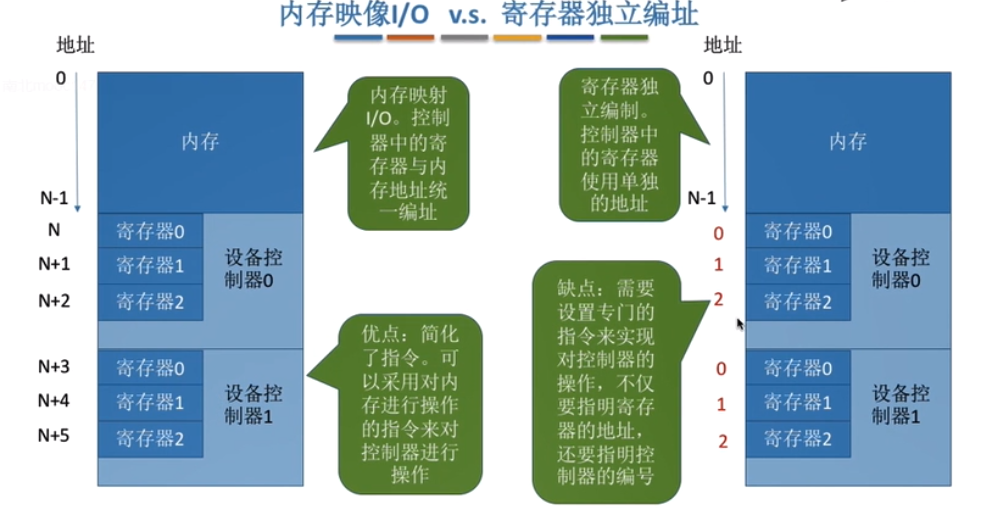

## IO控制方式
    1. 程序直接控制方式

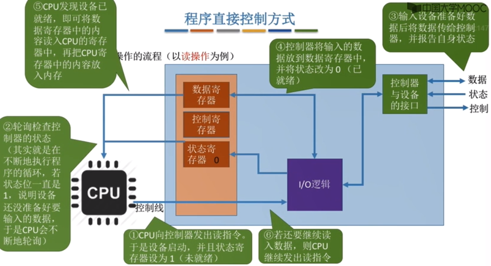

        1. 完成一次读写操作的的流程

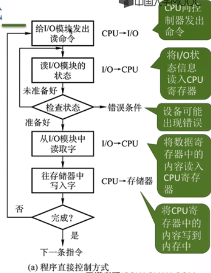

        2. CPU干预的频率
            * 很频繁，IO操作开始之前，完成之后都需要CPU的介入，并且在等待IO完成的过程中CPU需要不断的轮询检查。

        3. 数据传送的单位
            * 每次读/写一个字
        
        4. 数据的流向
            * 读操作（数据输入）：I/O设备 -> CPU（指CPU寄存器） -> 内存
            * 写操作（数据输出）：内存 -> CPU（指CPU寄存器） -> I/O设备

        5.优缺点
            * 优点：实现简单。在读/写指令之后，加上实现循环检验的一系列指令即可。（因此才被称为“程序直接控制方式”）

            * 缺点：CPU和I/O设备只能串行工作，CPU需要一直轮询检查，长期处于忙等状态，CPU利用率低

    2. 中段驱动方式

        1. 由于I/O设备速度很慢，因此在CPU发出读/写命令后，可将进程阻塞，先切换到别的进程执行。当I/O完成后，会保存
           当前进程运行环境信息，转去执行中端处理程序处理该中断。处理中断过程中，CPU从I/O控制器读一个字的数据传到
           CPU寄存器，再写入主存，接着CPU恢复等待I/O的进程（或者其他进程）的运行环境，然后继续执行

        2. 完成一次读/写操作的流程

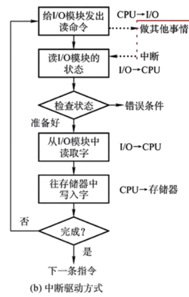

        3. CPU干预的频率
            * 每次I/O操作开始是之前，完成之后都需要CPU的介入。等待I/O完成的过程中CPU可以切换到别的进程执行

        4. 数据传送的单位
            * 每次读/写一个字

        5. 数据的流向
            * 读操作（数据输入）：I/O设备 -> CPU（指CPU寄存器） -> 内存
            * 写操作（数据输出）：内存 -> CPU（指CPU寄存器） -> I/O设备
        
        6. 优缺点
            * 优点：与“程序直接控制方式”相比，在“中断驱动方式”中，I/O控制器会通过中断信号主动报告I/O已完成，CPU不再
                    需要不停的轮询。CPU和I/O设备可以并行工作，CPU利用率得到明显的提升
            
            * 缺点：每个字在I/O设备与内存之间传输，都需要经过CPU，而频繁的中断处理会消耗比较多的CPU时间

    3. DMA方式
        * 概述
            与“中断驱动方式”相比，DMA方式（Direct Memory Access 直接存储器存取，主要用于块设备的I/O控制）有三个改进：
                <1> 数据传送单位是“块”。不再是一个字一个字的传送
                <2> 数据的流向是从设备直接放入内存，或者从内存直接到设备，不再需要CPU作为中介
                <3> 仅在传送一个或多个数据块开始和结束时，才需要CPU干预

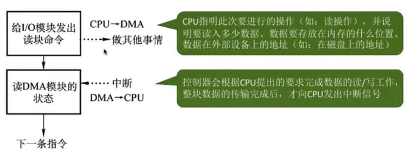

        * DMA控制器
             * DR（Data Register， 数据寄存器）：暂存从设备到内存，或从内存到设备的数据

             * MAR（Memory Address Register， 内存地址寄存器）：在输入时，MAR表示数据应该放到内存中的什么位置，输出时
                                                              MAR表示要输出的数据放在内存中的什么位置

             * DC（Data Conter， 数据计数器）：表示剩余要读/写的字节数

             * CR（Comand Register， 命令状态寄存器）：用于存放CPU发来的I/O命令，或设备的状态信息

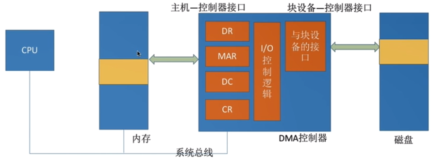

        * DMA方式
            1. 完成一次读/写操作流程（img125）
            
            2. CPU干预的频率
                * 仅在传送一个或多个数据块的开始和结束时，才需要CPU干预

            3. 数据传输的单位
                * 每次读写一个或多个块（注意：每次读写只能是连续的多个块，且这些块读入内存后在内存中也必须是连续的）

            4. 数据的流向（不再需要经过CPU）
                * 读操作（数据输入）：I/O设备 -> 内存
                * 写操作（数据输出）：内存 -> I/O设备

            5， 优缺点
                * 优点：数据以“块”为单位进行传输，CPU介入频率进一步降低。数据传输不再需要先经过CPU再写入内存，数据
                        传输效率进一步提升。CPU和I/O设备并行性进一步提升

                * 缺点：CPU每发出一条I/O指令，只能读写一个或多个连续的数据块。如果要读/写多个离散存储的数据块，或者
                        要将数据分别写到不同的内存区域时，CPU要分别发出多条I/O指令，进行多次中断处理才能完成

    4. 通道控制方式
        * 概述 
            * 通道：一种硬件，可以理解为“弱化版的CPU”，通道可以识别并执行一系列通道指令。（与CPU相比，通道可以执行
                    的指令很单一，并且通道程序是放在主机内存当中的，也就是说通道与CPU共享内存）

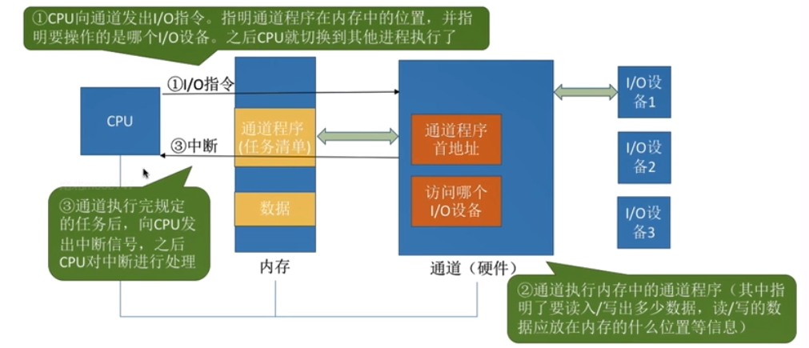

        * 通道控制方式
            1. 完成一次读/写操作的流程

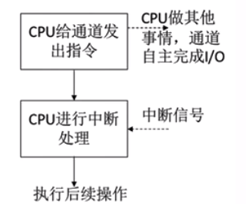

            2. CPU干预的频率
                * 极低，通道会根据CPU的指示来执行相的通道程序，只有完成一组数据块的读/写后才需要发出中断信号，请求
                  CPU干预
            
            3. 数据传输单位
                * 每次读/写一组数据块
            
            4. 数据的流向（在通道的控制下进行）
                * 读操作（数据输入）：I/O设备 -> 内存
                * 写操作（数据输出）：内存 -> I/O设备
            
            5. 优缺点
                * 优点：CPU、通道、I/O设备可并行工作，资源利用率很高
                
                * 缺点：实现复杂，需要专门的硬件支持

        * IO控制方式的对比

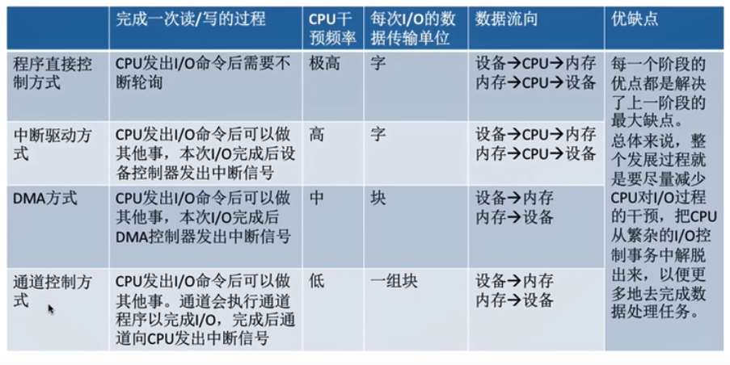

