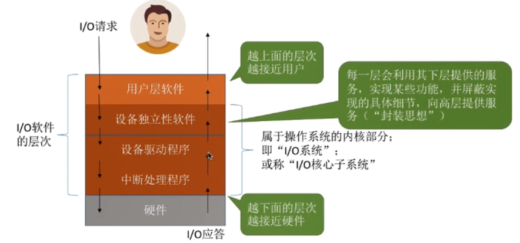
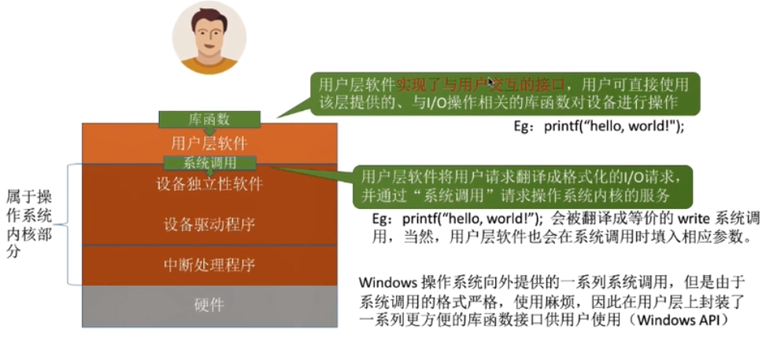

# IO软件层次结构
    1. 概述

    2. 用户层软件
        * 功能
            1. 提供库函数，用户层软件实现了与用户交互的接口，用户可直接使用该层所提供的、与I/O操作相关的库函数对设备
                进行操作
            
            2. 用户层软件会使用设备独立性软件提供的系统调用的功能，用户层软件将用户请求翻译成格式化的I/O请求，并通过
                “系统调用”请求操作系统内核的服务 

    3. 设备独立性软件
        * 概述：
            设备独立性软件，又称设备无关性软件。与设备的硬件特性无关的功能基本都在这一层实现

        * 功能
            1. 向上层提供统一的调用接口（如write/read 系统调用）

            2. 设备的保护
                * 原理类似于文件保护。设备被看作是一种特殊的文件，不同用户对各个文件的访问权限是不一样的，同样对设备的
                  访问权限也是不一样的
                
            3. 差错处理

            4. 设备的分配与回收

            5. 数据缓冲区管理
                * 可以通过缓冲技术屏蔽设备之间数据交换单位大小和传输速度的差异

            6. 建立逻辑设备名到物理设备名的映射关系：根据设备类型选择调用相应的驱动程序
                * 用户或用户软件发出I/O操作相关系统调用的系统调用时，需要指明此次操作的I/O设备的逻辑设备名
                
                * 设备独立性软件需要通过“逻辑设备表（LUT）”来确定逻辑设备对应的物理设备，并找到该设备对应的设备驱动程序

                * 操作系统管理设备逻辑表（LUT）的两种方式
                    1. 整个系统只设置一张LUT，这就意味着所有的用户不能使用相同的逻辑设备名，因此这种方式只适用与单用户
                        操作系统

                    2. 为每一个用户设置一张LUT，各个用户使用逻辑设备名可以重复，适用于多用户操作系统。系统在用户登录时为
                        其创建一个用户管理进程，而LUT就存放在用户管理进程的PCB中

        * 为什么不同的设备需要不同的设备驱动程序？
            不同设备的内部硬件特性也不同，这些特性只有厂家才知道，因此厂家必须提供与设备相应的驱动程序，CPU执行驱动程序
            的指令序列，来完成设置设备集成器，检查设备状态等工作

    4. 设备驱动程序
        * 主要负责对硬件设备的具体控制，将上层发出得一系列指令（如：write）转化成特定设备能识别的一系列操作。包括设置
          设备寄存器，检查设备状态等

        * 驱动程序一般会以一个独立的进程的方式存在

