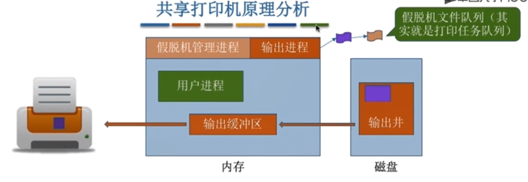

# IO核心子系统（IO系统）

## 整体介绍
    1. 功能需要在哪个层次实现？
        * 注意：假脱机技术（SPOOLing技术）需要请求“磁盘设备”的设备独立性软件提供的服务，因此一般来说假脱机
                技术是在用户软件层实现（可以归为“IO核心子系统”的功能）

    2. I/O调度
        * 概念：用某种算法去定一个好的顺序来处理各个I/O请求

        * 磁盘调度（先来先服务、最短寻道优先算法、Scan算法等）当多个磁盘I/O请求到来时，用某种调度算法确定满足
          I/O请求的顺序
        
        * 打印机等设备也能用先来先服务算法、优先级算法等来确定I/O调度顺序

    3. 设备保护
        * 与文件保护类似，设备被看作是一种特殊的文件，每个设备也会有对应的FCB，当用户请求某个设备时，系统会根据
          FCB中记录的信息来判断该用户是否有相应的访问权限，以实现“设备保护”的功能

## 假脱机技术
    1. 什么是脱机技术
        * “脱机”：脱离主机的控制进行的输入/输出操作

        * 脱机技术需要外围控制机的介入，在外围控制机的控制下，慢速输入设备的数据先被输入到更快速的磁带上。之后主机
          可从快速的磁带上读入数据，从而缓解了速度矛盾

        * 在缓解速度矛盾的同时，另一方面，即使在CPU忙碌时，也可以提前将数据输入到磁带：即使慢速的输出设备正在忙碌
          也可以提前将数据输出到磁带

    2. 假脱机技术
        * 概念原理    
            * 假脱机技术：又称“SPOOLing技术”是用软件的方式模拟脱机技术。会在磁盘上开辟两个存储区域“输入井”和“输出井”

            * 输入井：模拟脱机输入时的磁带，用于收容I/O设备输入的数据

            * 输出井：模拟脱机输出时的磁带，用于收容用户进程输出的数据   

            * 输入进程：模拟脱机输入时的外围控制机

            * 输出进程：模拟脱机输出时的外围控制机

            * 注意：SPOOLing技术需要多道批处理技术支持

            * 输入缓存区和输出缓存区是在内存中的缓存区

            * 在输入进程的控制下，“输入缓存区”用于暂存从输入设备输入的数据，之后再转存到输入井中 

            * 在输出进程的控制下，“输出缓存区”用于暂存从输出井送来的数据，之后再传送到输出设备上

 

    3. 共享打印机原理分析
        * 相关概念
            * 独占式设备：只允许各个进程串行使用的设备，一段时间内只能满足一个进程的请求

            * 共享设备：允许多个进程“同时”使用设备。可以同满足多个进程的使用请求

        * 打印机是一种独占式设备，我们通过SPOOLing技术将其改造为共享设备
        
        * 实现
            当多个用户进程提出输出打印请求时，系统会答应请求，但是并不是真正的把打印机分配给它们，而是由假脱机管理
            进程为每个进程做两件事：
                <1> 再磁盘输出井中为进程申请一个空闲缓存区（也就是说，这个缓存区是在磁盘上的），并将需要打印的数据
                    传入其中
                
                <2> 为用户进程申请一张空白的打印请求表，并将用户的打印请求填入表中（其实就是用来说明用会打印的数据
                    存放的位置等信息），再将该表挂到假脱机文件队列上

            当打印机空闲时，输出进程会从文件队列的对头取出一张打印请求表，并根据表中的要求将要打印的数据从输出井传输
            带上输出缓存区，再输出到打印机进行打印。（用这种方式可以一次处理完全部的打印任务）

            虽然系统中只有一台打印机，但每个进程提出打印请求时，系统都会为在输出井中为其分配一个存储区（相当于分配
            了一个逻辑设备），使得每个进程都觉得自己独占一台打印机，从而实现对打印机的共享

        * 注意：SPOOLing技术可以将一台物理设备虚拟成逻辑上的多态设备，可将独占式设备改造成共享式设备
        

