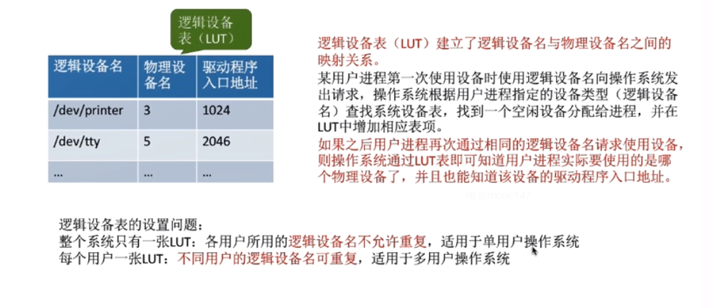

# 缓冲区管理与设备的分配与回收

## 缓存区管理
    1. 什么是缓冲区
        * 缓存区是一个存储区域，可以由专门的硬件寄存器组成，也可以利用内存作为缓存区。

        * 使用硬件作为缓存区的成本比较高，容量也小，一般仅仅用在对速度要求非常高的场合（如：存储管理中所用的联想寄存
          器，由于对页表的访问频率非常高，所以使用速度快的联想寄存器来存放页表项的副本）

        * 一般情况下，更多的是利用内存作为缓存区，“设备独立性软件”的缓存区管理就是要组织管理好缓存区

    2. 缓冲区的作用
        * 缓和CPU和I/O设备之间速度不匹配的矛盾

        * 减少CPU的中断频率，放宽对CPU中断相应时间时间的限制（只有在缓存区存满是才能读）

        * 解决数据粒度不匹配的问题（如：输出进程每次可以生成一块数据，当I/O设备每次只能读取一个字符）

        * 提高CPU与I/O设备之间的并行性

    3. 缓存区管理的策略
        1. 单缓冲
            * 假设某用户进程请求某种块设备读入若干块的数据，若采用单缓冲的策略，操作系统会在主存中为其分配一个缓冲区
            
            * 注意：当缓冲区数据非空时，不能往缓冲区冲入数据，只能从缓存区中把数据传出，当缓存区为空时，可以往缓冲区
                    冲入数据，但必须把缓冲区冲满以后，才能冲缓冲区中传出数据

            * 结论：采用单缓冲策略，处理一块数据平均耗时Max(C,T) + M

        2. 双缓冲
            * 假设某用户进程请求某种块设备读入若干块的数据。若采用双缓冲策略，操作系统会在主存中为其分配两块缓冲区

            * 结论：采用双缓冲策略，处理一个数据块的平均耗时为Max(T,C + M)
              

        3. 单缓冲与双缓冲在通信时的区别
            * 两台机器之间可以配置缓冲区用于数据的发送和接收

            * 单缓冲  

            * 双缓冲

        4. 循环缓冲区
            * 将多个大小相等的缓冲区链接成一个循环队列

        5. 缓冲池
            * 缓冲池由系统中共用的缓存区组成。这些缓存区按使用状况可分为：空缓冲队列、装满输入数据的缓冲队列（输入
              队列）、装满输出数据的缓冲队列（输出队列）

            * 另外，根据一个缓冲区在实际运算中扮演的功能不同，又设置了四种工作缓冲区：用于收容输入数据的工作缓冲区（
              hin）、用于提取输入数据的工作缓冲区（sin）、用于收容输出数据的工作缓冲区（hout）、用于提取输出数据的
              工作缓冲区（sout）

## 设备的分配与回收
    1. 设备分配时应考虑的因素
        <1> 设备的固有属性
            * 固有属性可分为三种：
                * 独占设备：一个时段只能分配给一个进程（如打印机）
                * 共享设备：可同时分配给多个进程（如磁盘）
                * 虚拟设备：采用SPOOLing技术将独占设备改造成虚拟的共享设备，可分配给多个进程使用（如采用SPOOLing技
                            术实现的共享打印机）

        <2> 设备分配算法
            * 先来先服务
            * 优先级高者优先
            * 短任务优先
            。。。

        <3> 设备分配的安全性
            * 两种分配方式：
                * 安全分配方式：为进程分配一个设备后就将进程阻塞，本次I/O完成后才将进程唤醒
                    * 一个时间段内每个进程只能使用一个设备
                    * 优点：破坏了“请求和保持”不会发生死锁
                    * 缺点：对于一个进程来说，CPU和I/O设备只能串行工作

                * 不安全分配方式：进程发出I/O请求后，系统为其分配I/O设备，进程可继续执行，之后还可以发出新的I/O请求。
                                只有某个I/O请求得不到满足时才会将进程阻塞
                    
                    * 一个进程可以同时使用多个设备
                    * 优点：进程的计算任务和I/O任务可以并行处理，使进程迅速推进
                    * 缺点：有可能发生死锁

    2. 静态分配和动态分配
        * 静态分配：进程运行前为其分配全部所需资源，运行结束后归还资源（破坏了“请求和保持条件”，不会发生死锁）

        * 动态分配：进程运行中动态申请设备资源

    3. 设备分配管理中的数据结构
        * “设备、控制器、通道”之间的关系（如图）

        * 设备控制表（DCT）：系统为每个设备配置一张DCT，用于记录设备情况

        * 控制器控制表（COCT）：每个设备控制器都会对应一张COCT。操作系统根据COCT的信息对控制器进行操作和管理

        * 通道控制表（CHCT）：每个通道会对应一张CHCT，操作系统根据CHCT的信息对通道进行操作和管理

        * 系统分配表（SDT）：记录系统中全部设备的情况，每个设备对应一个表目

    4. 设备分配的步骤
        * 基本步骤
            <1> 根据进程请求的物理设备名查找SDT（注意：物理设备名是进程请求分配设备时提供的参数）

            <2> 根据SDT找到DCT，若设备忙碌则将进程PCB挂到设备等待队列中，步忙碌浙江设备分配给进程

            <3> 根据DCT找到COCT，若控制器忙碌则将进程PCB挂到控制器等待队列中，不忙碌就将控制器发呢配给进程

            <4> 根据COCT找到CHCT，若通道忙碌就将进程PCB管道通道等待队列中，不，忙碌就将通道分配给进程

        * 设备分配步骤改进
            * 缺点：
                1. 用户编程时必须使用“物理设备名”底层细节对用户不透明，不方便编程
                2. 若换了一个物理设备，则程序无法执行
                3. 若进程请求的物理设备正在忙碌，则即使系统中还有同类型设备，进程也必须阻塞等待
            
            * 改进方法：建立逻辑设备名与物理设备名的映射机制，用户变成了公司只需提供逻辑设备名

    5. 总结

    
